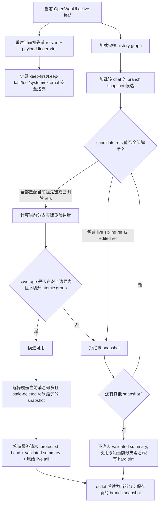

# fix: async-context-compression 分支感知的摘要复用方案

## 概览

本方案基于最新 `upstream/main` 的干净实现，从头设计 `async-context-compression` 的分支感知摘要复用能力。当前 upstream 的摘要复用是 count-only：`chat_summary` 对每个 chat 只保存一行摘要和 `compressed_message_count`，`inlet` 读取该 count 后直接组装 `[head] + [summary] + [tail]`。这个模型无法判断 count 覆盖的是哪一条 OpenWebUI 分支，也无法判断一个旧 summary 文本里是否包含当前活跃分支之外的 sibling 分支内容。

目标是：缓存摘要不能隐藏当前 OpenWebUI 活跃分支上的消息，也不能把仍然存在的 sibling 分支消息带进当前分支。例如原分支已经聊到 `m10` 并压缩，用户在 `m4` 处切换/分叉到 `m4'` 后继续聊到 `m8'`，旧摘要里的 `m4..m10` 不属于 `m4'` 这条活跃祖先链。因为 summary 文本不可拆，不能只声称它覆盖共同前缀 `m1,m2,m3` 然后继续复用；只要旧 snapshot 包含仍然存在但不在当前分支上的 `m4..m10`，它就不应作为当前分支的 validated summary 注入。

正确方向是为每条可压缩分支保存独立 snapshot，并验证 snapshot 的完整覆盖 refs：每个 ref 要么匹配当前活跃分支上对应的祖先消息及内容 fingerprint，要么能被证明是已经从 history graph 删除/墓碑化的旧祖先消息。任何仍然存在但不在当前活跃祖先链上的 ref 都是 sibling 分支内容，必须拒绝这个 snapshot。没有可用 snapshot 时，尤其是 `m1,m2,m3,m4'` 还没达到压缩门槛时，应直接使用原始消息；当 `m4'..m8'` 后续达到门槛时，再生成属于该分支的新 snapshot，切回原分支时原分支 snapshot 仍可继续使用。

## 问题背景

OpenWebUI 的聊天历史不是一个不可变数组，而是一棵消息图：

- `history.messages` 是 `{message_id: message}` 映射。
- `history.currentId` 指向当前活跃叶子节点。
- `parentId` 从活跃叶子节点一路回溯到根节点。
- `childrenIds` 表示同一个父节点下的多个 sibling 分支。
- `createMessagesList(history, currentId)` 通过 `parentId` 回溯再反转，只返回当前活跃分支。
- `Messages.svelte` 的 sibling 导航会选择目标 sibling，然后沿该 sibling 的 `childrenIds.at(-1)` 下钻到该分支最深叶子，并把 `history.currentId` 设为该叶子。因此切到 `m4'` 后，活跃消息链是 `m1,m2,m3,m4',...`；原来的 `m4,m5,...` 不会继续作为后续上下文的一部分。

最新 upstream 基线为 `upstream/main` commit `78b1d87`。该基线中：

- `ChatSummary` 只有 `chat_id`、`summary`、`compressed_message_count` 和时间戳。
- `chat_id` 是唯一索引，因此同一个 chat 只能保存一条当前摘要。
- `inlet` 加载 `summary_record` 后取 `compressed_message_count`，按 count 计算 tail 起点，并构造 summary marker。
- `outlet` 在后台生成新摘要，只有当新 `compressed_count` 大于旧值时才更新同一行。

这个 count 是数组坐标，但真正的身份来源应该是当前活跃分支的 message id 路径。同一个 count 过去可能表示“分支 A 的前 10 条消息”，后来可能指向“分支 B 的前 10 条消息”。更严重的是，旧 summary 文本本身可能已经总结了分支 A 中仍然存在的 sibling 消息；这种内容不能被当作分支 B 的共同前缀摘要复用。因此完整功能必须新增覆盖范围身份验证和分支本地 snapshot，而不是在现有 count-only 模型上做局部补丁。

## 需求追踪

- R1. 最终请求必须包含所有未被证明已由摘要覆盖的当前分支消息。
- R2. 一个 snapshot 只有在其完整 covered refs 都能解释为“当前活跃分支祖先消息”或“已删除/墓碑化的旧祖先消息”时，才可以作为 validated summary 注入。
- R3. snapshot 中任何仍然存在于完整 history graph、但不在当前活跃祖先链上的 ref，都是 sibling 分支内容；该 snapshot 不能用于当前分支，即使它和当前分支共享更短前缀。
- R4. 摘要覆盖范围内部发生分支分叉或删除时，不能用 `compressed_count - 1` 处理。删除可跳过，分叉不可跳过，二者必须依赖完整 history graph 区分。
- R5. 即使 message id 不变，只要消息内容被原地编辑，也必须使包含旧 fingerprint 的 snapshot 对当前分支失效，除非有更早、未覆盖编辑点的独立 snapshot。
- R6. 分支切换、重新生成、编辑、删除后，最新用户消息和其他 live-tail 消息必须原文保留在请求中。
- R7. 现有保护不回退：system message 必须保留，external reference 必须保护，native tool-call group 不能被切开。
- R8. 没有覆盖范围身份元数据的 legacy summary 必须安全降级，不能隐藏当前分支消息。
- R9. 每条分支应能维护自己的 snapshot：新分支达到压缩门槛后生成新 snapshot，切回旧分支时旧 snapshot 仍可继续复用。
- R10. 分支切换后才完成的异步摘要任务，不能覆盖其他分支的有效摘要状态。

## 范围边界

- 本方案目标仓库是插件仓库，主要修改 `plugins/filters/async-context-compression/async_context_compression.py`。
- 本方案不要求修改 OpenWebUI 本体。OpenWebUI 本体路径只作为行为参考。
- 本方案不尝试把旧摘要文本按共同前缀“语义裁剪”。生成出来的摘要是不可拆分文本，除非此前已经单独保存了对应前缀的 snapshot。
- 本方案不重新设计摘要 prompt，除非需要调整 marker 文案来区分“已验证覆盖摘要”和“降级历史参考”。
- 本方案不改变模型选择、compression style、外部引用聊天摘要、tool 输出裁剪等既有功能，只保证它们的现有不变量继续成立。

## 上下文与调研

### 相关代码与模式

- `plugins/filters/async-context-compression/async_context_compression.py`：插件单文件实现，包含 `ChatSummary` 表模型、`inlet`、`outlet`、`_build_summary_message`、`_get_summary_view_state`、`_calculate_target_compressed_count`、`_reconstruct_active_history_branch`、`_load_full_chat_messages`、`_save_summary`、`_generate_summary_async`。
- `plugins/filters/async-context-compression/test_async_context_compression.py`：现有单测入口，覆盖摘要坐标、tool grouping、引用聊天摘要、异步摘要行为。
- `plugins/filters/async-context-compression/README.md`：描述 inlet/outlet 两阶段流程和当前 `chat_summary` 表。
- `plugins/filters/async-context-compression/v1.4.1.md`：曾修复 outlet 阶段 coordinate drift，说明 inlet/outlet 看到的消息视图可能不一致。
- `plugins/filters/async-context-compression/v1.4.0.md`：曾引入 atomic tool-call grouping，新的分支感知逻辑不能破坏这些 group。
- `plugins/filters/async-context-compression/FIX_SUMMARY_20260426.md`：已有摘要边界和 keep-first 相关记录。
- OpenWebUI 参考路径 `src/lib/utils/index.ts`：`convertMessagesToHistory`、`sanitizeHistory`、`createMessagesList`。
- OpenWebUI 参考路径 `src/lib/components/chat/Messages.svelte`：编辑、Save as Copy、分支导航、删除行为。
- OpenWebUI 参考路径 `backend/open_webui/models/chat_messages.py`：标准化 `chat_message` 存储、复合 id、重建 `{message_id: message}` map。

### 需要保持的既有行为

- 插件仍然是单个可上传的 Python filter 文件。
- 数据库初始化仍然 lazy，并复用 OpenWebUI shared database connection。
- 摘要生成仍然在 `outlet` 异步执行，不能阻塞当前用户回复。
- `keep_first`、`keep_last`、system message 保留、external reference 保护、native tool-call atomic grouping 都仍然参与边界计算。
- 摘要模型调用失败时，主聊天请求不能因此失败。

### 核心结论

摘要有效性的基本单位不是 count，也不是单个 boundary node，而是 snapshot 的完整有序消息身份序列，以及这些 refs 相对于当前活跃分支和完整 history graph 的关系。每个 ref 至少要包含 `(message_id, payload_fingerprint)`。count 仍然可用于预算、展示和排序，但不能用于证明覆盖范围。

## 关键技术决策

- 保存覆盖身份，而不只保存覆盖进度：每个持久化摘要 snapshot 都应携带它实际总结过的完整有序消息身份列表。
- 使用 message id 加 payload fingerprint：id 用于区分内容相同的兄弟分支，fingerprint 用于检测 id 不变但内容被原地编辑的情况。
- 验证 snapshot 全内容，而不是只验证可覆盖前缀：summary 文本不可拆，因此 candidate refs 中每一项都必须被消费。它要么按顺序匹配当前活跃分支 refs，要么能被证明已从完整 history graph 删除/墓碑化；不能把仍然存在的 sibling refs 留在 summary 文本里再声称只复用共同前缀。
- 删除和分支分叉分开处理：删除意味着旧 ref 已不再是 live graph 节点，summary 多带一点旧祖先内容可接受；分叉意味着旧 ref 仍然存在于 sibling branch，注入 summary 会污染当前分支，必须拒绝。
- 每个 chat 保存多个 branch-local summary snapshots：单行 `chat_summary` 无法同时表达旧分支的 `m1..m10` 和新分支的 `m1,m2,m3,m4'..m8'`。
- 旧摘要文本视为不可拆分：如果需要复用共同前缀，必须存在一个确实只总结到该前缀、或只额外包含已删除 refs 的 snapshot；不能从一个覆盖 sibling suffix 的长 summary 中“裁剪”出前缀。
- 分离展示进度与已验证覆盖范围：summary marker 里的 `covered_until` 可用于 UI/status 和坐标重建，但 inlet 必须从 snapshot 元数据重新计算“当前分支实际覆盖数量”，不能直接使用 snapshot 自身的 `compressed_message_count`。
- 异步保存必须按分支隔离：晚完成的后台任务应保存它实际总结的 branch snapshot，而不是覆盖 chat 的唯一摘要行。

## 计划内已解决问题

- 单个 boundary message id/hash 是否足够？不够。它无法证明边界之前的整段消息仍然属于当前分支。
- message id 能否替代 fingerprint？不能。OpenWebUI 支持原地编辑消息，id 可能不变。
- 旧摘要文本能否按 common prefix 裁剪？不能。摘要是生成文本，没有可靠的内部映射能还原到源消息边界；实现只能决定当前分支哪些消息可被它代表，以及从哪里开始保留原文 tail。
- 删除是否应该直接让摘要失效？不应该。删除已覆盖旧消息时，summary 可能多带一点旧内容，但只要新增/编辑后的当前消息没有被错误覆盖，就比完全放弃摘要更实用。

## 延后到实现阶段的问题

- 具体数据库列名和索引：实现时结合 SQLAlchemy 模型和 lazy migration 细节确定。
- snapshot 保留数量：实现时结合预期行数增长和清理成本选择保守默认值。
- 完整 history graph 的获取路径：如果 incoming `body.messages` 只包含当前活跃分支，插件必须从 DB 加载完整 `history.messages`，才能区分“已删除 ref”和“仍存在但不在当前分支上的 sibling ref”。如果实现阶段发现无法可靠获得完整 graph，则不能跳过 unmatched refs，只能拒绝该 snapshot。
- 是否保留 legacy over-covering summary 作为降级历史参考：第一版应先保守处理，只有测试证明 latest/live-tail 足够稳定时再考虑加入。

## 高层技术设计

> 下图只表达方案形状，用于 review 技术方向，不是实现规范。实现者应把它当作上下文，而不是照抄代码。

关键点：candidate 的完整 refs 都必须有解释。旧 snapshot 覆盖 `m1..m10`，当前分支变成 `m1,m2,m3,m4'..m8'` 时，`m4..m10` 仍存在于完整 history graph 且不在当前祖先链上，所以这是 live sibling divergence，该 snapshot 不能用于当前分支。只有已经删除/墓碑化的旧 refs 可以被跳过。

## 建议数据模型

保留现有 `chat_summary` 表作为兼容层或 optional current pointer。新增面向 snapshot 的存储模型，使一个 chat 可以保存多个有效摘要。

建议 snapshot 字段：

- `id`：snapshot id。
- `chat_id`：所属 chat。
- `summary`：生成的摘要文本。
- `compressed_message_count`：实际总结的当前活跃分支消息数量。
- `covered_message_refs_json`：有序 compact refs 列表，每个 ref 包含稳定 message id 和 payload fingerprint。
- `covered_refs_hash`：refs 列表 hash，用于诊断和可选快速查找。
- `branch_tip_id`：最后一个 covered message id。
- `source_current_id`：生成 snapshot 时的活跃 leaf id，用于排查 late async save。
- `created_at`、`updated_at`。

可选保留字段：

- `superseded_at`：如果实现 lazy prune。
- `source`：如果同一张表同时保存当前 chat 和 referenced chat summary，可区分来源。

存储注意点：即使保存 hash，也要保存完整有序 refs JSON。hash 可以证明相等，但无法计算 common prefix，也无法解释第一个 mismatch 在哪里。

## Snapshot 选择规则

1. 从请求 body 或 DB 重建当前活跃分支消息列表，得到从 root 到 `history.currentId` 的有序 refs。
2. 加载完整 `history.messages` graph，建立 live message id 集合和当前祖先 id 集合。这个步骤用于区分删除和 sibling 分叉。
3. 将当前活跃分支每条消息转成 ref，包含 message id 和 payload fingerprint。
4. 继续使用现有 keep-first、keep-last、system message、external reference、atomic tool-call group 逻辑计算最大安全压缩边界。
5. 加载该 `chat_id` 的 snapshot 候选，逐个验证 candidate 的完整 `covered_message_refs_json`。
6. 每个 candidate 只有满足以下条件才可接受：
   - candidate refs 长度大于 0；
   - 从头到尾扫描 candidate refs，每个 ref 必须要么匹配当前分支中的下一个 ref，要么能被证明是 deleted/tombstoned ref；
   - 如果 candidate ref 的 message id 仍存在于完整 history graph，但它不是当前分支中下一个祖先 ref，说明它属于 live sibling branch，candidate 必须拒绝；
   - 如果 candidate ref 的 message id 是当前分支 ref，但 payload fingerprint 不同，说明同一消息被原地编辑，candidate 必须拒绝；
   - candidate 扫描完成后，实际匹配到的当前分支 coverage 不能超过 keep-last/system/external-reference/atomic tool-call 共同决定的安全边界；
   - 当前实际 coverage 不切开 atomic tool group。
7. 选择“覆盖当前消息最多”的可接受 snapshot；如果覆盖数量相同，优先选择 skipped deleted refs 更少、更新时间更新的 snapshot。
8. 如果没有任何候选可接受，不注入“已验证覆盖摘要”。请求应按照现有 raw-context 和 hard-trim 逻辑安全保留当前分支消息。
9. 允许后续 `outlet` 为当前分支生成新的 snapshot；这个 snapshot 不覆盖其他分支 snapshot。

## Mismatch 场景处理

### 分支分叉

例子：

- 旧 snapshot 覆盖原分支 `m1,m2,m3,m4,m5,m6,m7,m8,m9,m10`。
- 用户在 `m4` 位置切换/分叉到 sibling `m4'`，后续当前分支变成 `m1,m2,m3,m4',m5',m6',m7',m8'`。

旧 snapshot 不能作为当前分支的 summary 注入。它不只是“覆盖太多”而已，而是 summary 文本里包含仍然存在的 sibling branch 内容 `m4..m10`。这些消息不属于 `m4'` 的祖先链，也不是已经删除的旧祖先消息；如果注入，LLM 会同时看到另一条分支的内容，可能把旧问题当成当前问题。

正确行为是：

- 如果存在独立 snapshot 覆盖当前分支的任意安全前缀，例如只覆盖 `m1,m2`，或覆盖共同祖先 `m1,m2,m3`，且没有包含 live sibling refs，则可以复用这个较短 snapshot；覆盖点之后的 `m3,m4',...` 或 `m4',...` 必须继续作为原文 live tail 进入请求。
- 如果没有这样的 snapshot，且 `m1,m2,m3,m4'` 还没达到压缩门槛，就直接发送原始当前分支消息。
- 当 `m4'..m8'` 后续达到压缩门槛时，生成一个属于新分支的 snapshot，refs 形如 `m1,m2,m3,m4',...,m8'`。
- 用户切回原分支 `m1..m10` 时，原 snapshot 仍然可以被原分支复用。

不能推断 `compressed_count - 1` 是安全边界，也不能把一个覆盖 sibling suffix 的长 summary 当作共同前缀 summary 使用。安全边界必须由完整 candidate refs 的可解释性决定。

### 原地编辑

如果 message id 相同但 payload fingerprint 不同，说明当前 live message 的内容已经变了。包含旧 fingerprint 的 snapshot 不能作为当前分支的 validated summary 注入，因为 summary 文本可能包含旧内容。实现可以选择一个更早、未覆盖编辑点的独立 snapshot；如果没有，则使用原始当前分支消息直到生成新 snapshot。

### 删除已覆盖消息

如果删除导致当前活跃分支缺少某个 covered id，且完整 history graph 中也不存在这个 id，选择器可以把 snapshot refs 里的这个旧 id 视为 deleted/tombstoned ref 并跳过，然后继续匹配后续当前 refs。例如 snapshot 覆盖 `m0,m1,deleted_m2,m3,m4`，当前分支是 `m0,m1,m3,m4,new_m5`，summary 可以替代当前 `m0,m1,m3,m4`，但 `new_m5` 必须原文保留。

这样做的取舍是：summary 可能包含一点已经删除的旧祖先内容，但不会把删除后新增的真实问题藏进旧 summary。相比删除一条旧消息就让摘要完全失效，这更符合长对话压缩的使用方式。

重要限制：只有能证明 ref 已不在完整 history graph 中时，才按删除处理。如果 ref 仍存在但不在当前祖先链上，它就是 sibling branch，不是删除。

### 缺少 message id 或完整 graph

如果 incoming messages 缺少稳定 ids，且无法通过 DB-backed reconstruction 对齐到 OpenWebUI message ids，选择器不应声明 validated coverage。仅 fingerprint 匹配可用于诊断，但不能保证分支安全，因为兄弟分支可能内容相同。

如果实现阶段只能看到当前活跃分支列表、看不到完整 `history.messages` graph，则不能安全地区分 deleted ref 与 live sibling ref。此时第一版应拒绝包含 unmatched refs 的 candidate，而不是把它们当作删除跳过。

### Legacy 单行 summary

没有 coverage metadata 的 legacy rows 不能隐藏 live-tail 消息。第一版安全行为应是：

- 仅把它们作为迁移输入或降级参考；
- 不把它们的 `compressed_message_count` 当作已验证覆盖范围；
- 达到阈值后为当前分支生成新的 branch-valid snapshot。

如果后续加入 degraded reference mode，必须在注入 prompt 里明确标记这是“未验证历史参考”，并且仍要把所有未验证覆盖的当前分支消息原文放入请求。

## 实施单元

- [ ] **Unit 1: 用测试刻画活跃分支身份和当前失败模式**

**目标：** 增加测试证明 upstream 的 count-only summary reuse 无法安全处理分支分叉，并刻画完整功能的期望行为。

**需求：** R1, R2, R3, R5

**依赖：** 无

**文件：**
- Modify: `plugins/filters/async-context-compression/test_async_context_compression.py`

**方案：**
- 构造 OpenWebUI 风格的 active branch fixture，包括稳定 ids、parent links、分叉 sibling branches。
- 复现关键坏例子：旧 summary 覆盖旧分支 suffix，而当前分支从共同祖先后长出了新 suffix。
- 断言仅依赖 `compressed_message_count` 不安全，期望行为必须是基于当前分支 refs 计算实际覆盖数量，并保留未覆盖的 live tail。

**执行提示：** 先写 characterization tests，再改实现逻辑。

**参考模式：**
- `plugins/filters/async-context-compression/test_async_context_compression.py` 里的现有 unittest 风格。

**测试场景：**
- Happy path：snapshot refs 全部按顺序匹配当前分支 refs，且 coverage 在安全边界内 -> snapshot 被接受，并记录当前实际覆盖数量。
- Edge case：原分支 snapshot 覆盖 `m1..m10`，当前分支切到 `m4'..m8'` -> 旧 snapshot 因包含 live sibling refs 被拒绝，当前分支消息原文保留。
- Edge case：存在只覆盖当前祖先安全前缀的独立 snapshot，例如 `m1,m2` 或 `m1,m2,m3` -> 可以接受它，并保留覆盖点之后的 `m3,m4'..m8'` 或 `m4'..m8'` live tail。
- Edge case：两个 sibling branches 内容相同但 ids 不同 -> id mismatch 拒绝错误分支 snapshot。

**验证：**
- 测试能明确描述 upstream count-only 行为为什么不安全，并能在旧设计上失败。

- [ ] **Unit 2: 引入消息覆盖 refs**

**目标：** 增加 helpers，用于从活跃分支生成稳定 refs 和 payload fingerprints。

**需求：** R2, R4, R7

**依赖：** Unit 1

**文件：**
- Modify: `plugins/filters/async-context-compression/async_context_compression.py`
- Modify: `plugins/filters/async-context-compression/test_async_context_compression.py`

**方案：**
- 定义 compact message ref，包含 message id 和 normalized payload fingerprint。
- fingerprint 覆盖会影响模型可见语义的字段：role、content、output、tool calls、tool call id、必要时 files/sources。
- 从 OpenWebUI history map 重建分支时，如果 message value 缺少 `id`，保留 map key 作为 canonical id。
- refs 与 summary marker display metadata 保持分离。

**参考模式：**
- `_reconstruct_active_history_branch` 已有从 `history.messages` 和 `currentId` 重建活跃分支的逻辑。
- 现有 response parsing 和 token helpers 采用显式 normalize 后再解析/计数。

**测试场景：**
- Happy path：OpenWebUI history map value 缺少嵌入 `id` 时，refs 使用 map key。
- Edge case：同一 id 的 content 被编辑后 fingerprint 改变。
- Edge case：相同 content 但不同 ids 产生不同 refs。
- Edge case：tool-call metadata 改变会改变 fingerprint。
- Error path：缺少可用 id 的 message 被标记为不能用于 branch coverage。

**验证：**
- coverage helpers 输出稳定，且不依赖列表位置本身。

- [ ] **Unit 3: 增加 snapshot 持久化**

**目标：** 每个 chat 可以持久化多个 branch-specific summary snapshots。

**需求：** R2, R3, R7, R8

**依赖：** Unit 2

**文件：**
- Modify: `plugins/filters/async-context-compression/async_context_compression.py`
- Modify: `plugins/filters/async-context-compression/test_async_context_compression.py`

**方案：**
- 新增 lazy-created snapshot table，而不是继续把唯一 `chat_summary.chat_id` 行当作唯一真相。
- 每个 snapshot 保存 ordered refs JSON 和 hash。
- 保持现有 `chat_summary` 兼容，避免已安装环境启动失败。
- 增加 retention 逻辑，限制每个 chat 保存的 snapshot 数量，优先保留更新、更大、可精确复用的前缀 snapshots。

**参考模式：**
- `_init_database` 里的 lazy database initialization 与兼容行为。
- 现有 `_save_summary` 的 optimistic save 思路，但从“单行胜出”改成“分支 snapshot 独立保存”。

**测试场景：**
- Happy path：同一 chat 下保存两个不同 branch tip 的 snapshots，二者都保留。
- Happy path：加载 candidates 时优先返回覆盖更多、更新的 snapshots。
- Edge case：旧分支 late async save 不删除或覆盖当前分支 snapshot。
- Edge case：只有 legacy `chat_summary` 行、没有 snapshot rows 时，启动和加载仍然正常。
- Error path：refs JSON 损坏时忽略为 invalid coverage，不影响聊天。

**验证：**
- snapshot persistence 能支持 branch-specific reuse，没有单行覆盖竞态。

- [ ] **Unit 4: 用当前分支有序覆盖匹配替换 summary selection**

**目标：** `inlet` 只有在 snapshot 的完整 refs 都能解释为当前分支祖先或已删除 refs 时才选择 summary，并使用当前实际覆盖数量作为 tail 起点。

**需求：** R1, R2, R3, R5, R6, R7

**依赖：** Units 2 and 3

**文件：**
- Modify: `plugins/filters/async-context-compression/async_context_compression.py`
- Modify: `plugins/filters/async-context-compression/test_async_context_compression.py`

**方案：**
- 用完整 candidate refs validation 替换 upstream count-only applicability check；不能只取 longest common prefix。
- 继续使用 keep-first、keep-last、system preservation、external references、atomic tool-call grouping 计算当前分支 safe boundary，并按当前实际覆盖数量对 candidates 进行限制。
- 最终请求由 protected head、validated summary marker、preserved system messages、以及 selected coverage 后的原始 live tail 组成。
- 如果没有 candidate 的完整 refs 可被安全解释，不注入 validated summary，让现有 hard-limit trimming 在 raw messages 上安全工作。

**参考模式：**
- 现有 inlet `[head] + [summary] + [tail]` 组装逻辑。
- `_align_tail_start_to_atomic_boundary` 和 `_get_atomic_groups` 的 native tool-call 安全行为。

**测试场景：**
- Happy path：snapshot refs 全部匹配当前分支祖先 refs，且没有 live sibling/edited refs -> 替代 covered prefix，并保留 tail。
- Edge case：共同祖先后分叉，存在只覆盖共同祖先且没有 live sibling refs 的 snapshot -> 选择该 snapshot。
- Edge case：分叉但没有共同祖先独立 snapshot -> 拒绝旧分支 snapshot，当前分支消息原文保留。
- Edge case：当前分支删除了已覆盖旧消息 -> 只有该旧 id 不在完整 history graph 中时，才允许跳过并继续覆盖后续当前 refs。
- Edge case：压缩 gap 内的 system messages 仍然被保留。
- Edge case：external reference messages 不被当作普通旧历史丢弃。
- Edge case：selected coverage 不能切开 assistant/tool/tool-result atomic group。
- Error path：所有 candidates invalid -> 仍发送合法请求。

**验证：**
- Inlet 请求构造由 validated coverage 驱动，不再依赖 stale count metadata。

- [ ] **Unit 5: outlet 保存实际覆盖范围的 snapshots**

**目标：** 新摘要必须记录它实际总结过的 refs。

**需求：** R2, R4, R6, R8

**依赖：** Units 2, 3, and 4

**文件：**
- Modify: `plugins/filters/async-context-compression/async_context_compression.py`
- Modify: `plugins/filters/async-context-compression/test_async_context_compression.py`

**方案：**
- `_generate_summary_async` 选出 `middle_messages` 后，计算新摘要实际覆盖的原始活跃分支范围。
- 保存该范围的 ordered refs 和 `compressed_message_count`。
- 如果 summary input 为适配 summary model 上下文窗口而丢弃了最新 atomic groups，保存 refs 时必须排除这些被丢弃的 groups。
- late async result 保存为它自己的 snapshot，不假设它仍然是当前分支。

**参考模式：**
- 现有 target compressed count 计算和 prompt fitting loops。
- 现有 summary model 上下文过小时从 summary input 丢弃最新 atomic groups 的行为。

**测试场景：**
- Happy path：正常 outlet 保存的 summary 包含实际 summarized messages 的 refs。
- Edge case：prompt fitting 丢弃最新 atomic group -> saved refs 排除被丢弃 group，之后该 group 保持 live tail。
- Edge case：outlet 收到不含 summary marker 的 body，并在计算新进度前 reinject 一个 validated snapshot。
- Edge case：两个不同分支的 async tasks 保存独立 snapshots，切回旧分支时旧 snapshot 仍被选中。
- Error path：summarized range 缺少稳定 ids -> 不保存为 branch-valid coverage。

**验证：**
- 持久化 snapshot 描述真实 summary input，而不是拟定但后来被 fitting 改变的边界。

- [ ] **Unit 6: Legacy 迁移、降级行为与诊断**

**目标：** 旧安装环境安全可升级，同时保留可排查性。

**需求：** R1, R5, R7

**依赖：** Units 3 and 4

**文件：**
- Modify: `plugins/filters/async-context-compression/async_context_compression.py`
- Modify: `plugins/filters/async-context-compression/test_async_context_compression.py`
- Modify: `plugins/filters/async-context-compression/README.md`
- Modify: `plugins/filters/async-context-compression/README_CN.md`

**方案：**
- 启动时 lazy create snapshot storage。
- Legacy rows 可读取用于 operator visibility，但没有 refs metadata 时不能当作当前分支覆盖证明。
- 增加 debug logs，说明 candidate rejection 原因：common-prefix length、第一个 mismatch 位置、missing id、changed fingerprint、unsafe atomic boundary。
- 文档说明升级后第一轮可能发送更多 raw context，直到生成 branch-valid snapshot。

**参考模式：**
- 现有 README/README_CN 双语文档模式。
- 现有 debug logging 风格。

**测试场景：**
- Happy path：存在 legacy row 但无 snapshot -> 请求包含当前分支消息，并在之后生成新 snapshot。
- Edge case：legacy row count 超过当前分支长度 -> 不隐藏 live-tail。
- Edge case：stored metadata 损坏 -> warning log + safe fallback。
- Error path：snapshot table 创建失败 -> 插件表现为没有 valid summary coverage，而不是中断聊天。

**验证：**
- 升级路径安全，并解释为什么短期压缩率可能降低。

## 系统影响

- **交互图：** `inlet` selection、`outlet` summary generation、lazy DB setup、referenced-chat summary cache、debug logging 都会接触 summary state。
- **错误传播：** 无效或缺失 summary metadata 应降级为 raw-context 行为和诊断日志，不能导致聊天请求失败。
- **状态生命周期风险：** 后台任务可能在分支切换后才完成。snapshot persistence 通过 covered refs 隔离结果，避免替换 chat 唯一摘要行。
- **API 表面：** 插件仍是单个 OpenWebUI filter 文件，不需要 OpenWebUI core API 变更。
- **集成覆盖：** 单测应覆盖 branch graph 场景；手工验证应覆盖 edit、regenerate、branch switch、delete、long-context compression。
- **不变项：** system messages 仍保持原始消息，external references 仍受保护，native tool-call groups 仍保持 atomic，summary failures 仍不影响主聊天。

## 风险与缓解

| 风险 | 缓解 |
|------|------|
| snapshot table 增加存储量 | 增加每 chat retention 上限，refs 保持 compact。 |
| legacy summaries 被复用得更保守 | 优先正确性；升级后为当前分支重新生成 branch-valid snapshots。 |
| 无法拿到完整 `history.messages` graph | 不把 unmatched refs 当作删除跳过；拒绝 candidate 并保留原始当前分支消息。 |
| 非标准 OpenWebUI 流程里的 body messages 缺少 ids | 能 DB reconstruction 就用 DB；不能就不声明 validated coverage。 |
| summary prompt fitting 改变实际覆盖范围 | fitting 后再保存 refs，不能 fitting 前保存。 |
| candidate selection 更难排查 | 输出 matched coverage、skipped deleted refs、第一处 live sibling/edited mismatch 原因。 |
| 多 snapshots 让 current pointer 语义复杂 | snapshots 是 source of truth；单行 current pointer 只作为优化或兼容层。 |

## 文档与运维说明

- 更新 `README.md` 和 `README_CN.md`，说明 branch-aware summary reuse，以及为什么旧摘要可能需要重新生成。
- 为下一个插件版本增加 release note，说明 stale-branch summary 修复。
- 推出时建议打开 debug logs，用长对话分支和编辑消息验证。
- 文档说明不需要额外 OpenWebUI 数据库迁移命令，因为插件会 lazy 初始化自己的表。

## 手工验证场景

- 创建一个触发压缩的长聊天，从较早用户消息处分支，提出新的最新问题，确认旧分支 summary 没有注入，新分支消息原文发送给 LLM。
- 原地编辑一条已被摘要覆盖的用户消息，确认旧 summary coverage 不再复用。
- 重新生成或 Save as Copy 一个 assistant response，在 siblings 之间切换，确认每个分支能选择自己的匹配 snapshot，且不会复用包含另一分支 sibling refs 的 snapshot。
- 删除已覆盖范围中的一条消息，确认只有该 id 从完整 graph 消失时才按删除跳过，请求不会隐藏重连后的 branch tail。
- 使用 native tool-calling 聊天跨过压缩阈值，确认 snapshot selection 后 tool-call groups 仍然有效。

## 被考虑但不采用的方案

- **单个 boundary id/hash：** 无法证明边界之前的消息仍属于同一分支。
- **mismatch 后只回退一条：** 分叉可能发生在更早位置，回退一条没有依据。
- **只保存整个 covered range hash，不保存 refs：** 无法解释 mismatch，也无法选择更短前缀 snapshot。
- **只用 message ids，不用 fingerprints：** 原地编辑时 id 可能不变。
- **任何 mismatch 都直接丢弃摘要：** 对 live sibling/edited mismatch 必须丢弃该 snapshot；但对能证明已删除的旧 refs，可以跳过并继续复用 snapshot。
- **靠 prompt 要求 LLM 忽略 stale summary suffix：** 不足以作为正确性保证；请求结构本身不能依赖 prompt 文案来补偿错误覆盖。

## 成功标准

- 插件不会移除任何当前分支消息，除非该消息 ref 已按顺序出现在选中 snapshot 的 covered refs 中，并且该 snapshot 没有包含 live sibling refs 或 edited refs。
- 原分支 `m1..m10` 的 summary 不会在 `m4'` 新分支中被当作共同前缀 summary 注入；没有分支本地 snapshot 时使用原始当前分支消息。
- 新分支达到压缩门槛后会生成自己的 branch-local snapshot；用户切回旧分支时旧 snapshot 仍可复用。
- 删除已覆盖旧消息时，只有能证明旧 ref 已不在完整 history graph 中，才允许跳过该 ref 并复用 snapshot。
- 分支切换、编辑、重新生成、删除后，分支本地最新消息以原文出现在最终请求中。
- 旧分支摘要不能让 LLM 把已删除或 sibling branch 上的旧 prompt 当成最新用户请求回答。
- 异步摘要任务晚完成也不会破坏其他分支的摘要状态。
- 现有长对话压缩、system preservation、native tool-call integrity 测试继续通过。

## 来源与参考

- Upstream 基线：`upstream/main` at `78b1d87` after `git fetch upstream` on 2026-06-22
- 插件 filter：`plugins/filters/async-context-compression/async_context_compression.py`
- 插件测试：`plugins/filters/async-context-compression/test_async_context_compression.py`
- 插件 README：`plugins/filters/async-context-compression/README.md`
- 既有 coordinate drift 记录：`plugins/filters/async-context-compression/v1.4.1.md`
- 既有 atomic grouping 记录：`plugins/filters/async-context-compression/v1.4.0.md`
- 既有 summary boundary 记录：`plugins/filters/async-context-compression/FIX_SUMMARY_20260426.md`
- OpenWebUI 参考：`src/lib/utils/index.ts`
- OpenWebUI 参考：`src/lib/components/chat/Messages.svelte`
- OpenWebUI 参考：`backend/open_webui/models/chat_messages.py`
