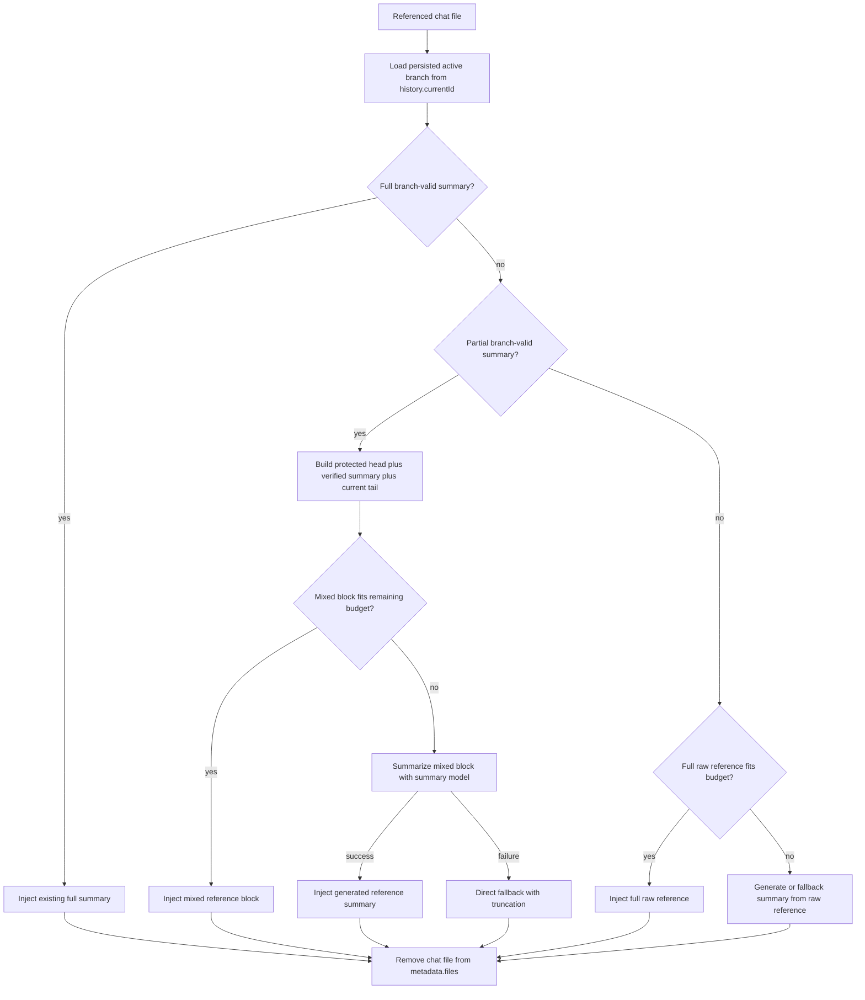
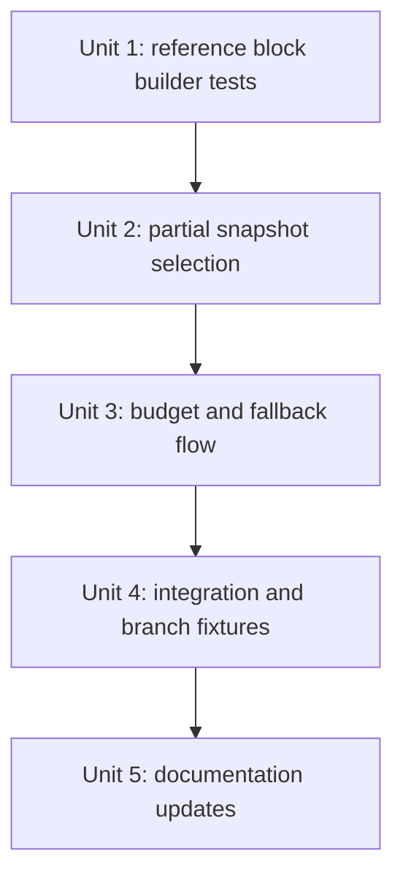

# feat: 引用长对话时复用部分摘要

## 概览

改进 `async-context-compression` 的引用对话处理逻辑：当被引用对话很长时，如果没有覆盖整条当前分支的摘要，可以复用覆盖范围最大的 branch-valid 部分摘要，再拼接未覆盖的近期原文 tail，而不是拒绝所有非完整摘要并回退到全文注入或重新调用 summary model 现场生成引用摘要。

本计划只作用于插件的外部 chat reference 路径。当前会话压缩已经会为正在聊天的会话组装 `head + summary + tail`；本计划把同样的安全姿态扩展到被引用对话：`protected head + verified summary + uncovered tail`，同时保留引用路径自己的 wrapper 和 fallback 行为。

## 问题背景

启用插件后，Open WebUI 的 chat reference 会先被插件拦截，避免默认 chat RAG 再处理一次。插件当前通过 `_load_full_chat_messages()` 加载被引用 chat 的 active branch，然后调用 `_load_applicable_summary_snapshot(..., require_full_coverage=True)`。

这个 full coverage 要求安全，但对很长的引用对话过于严格。例如被引用 chat 已有一个覆盖消息 `1-500` 的有效摘要，当前 active branch 还有 live tail `501-520`，插件会因为摘要没有覆盖整个分支而拒绝复用。对大对话来说，这会让注入输入爆炸、强制重新调用 LLM 生成引用摘要，或在截断时丢掉有用的旧上下文，即使已经存在一个经过验证的前缀摘要。

目标行为是：优先使用完整 branch-valid summary；如果没有，则使用覆盖范围最大的 branch-valid partial summary，并追加当前分支未覆盖消息的原文 tail，同时保持清晰的 reference block 结构和可预测的预算处理。

实现还应通过可观察信号验证价值，而不只是通过行为测试：长引用对话应比当前全文路径注入更少 raw tokens；当存在 branch-valid 前缀摘要时，应避免不必要的现场引用摘要调用；当未覆盖 tail 被总结或裁剪时，应记录 metadata-only 诊断。

## 需求追踪

- R1. 当不存在 full-coverage summary，且 partial summary 覆盖被引用 chat 当前分支的安全前缀时，应复用该 branch-valid partial summary。
- R2. 引用注入必须包含 selected summary 未覆盖的所有当前分支消息，除非发生显式预算裁剪或 fallback summarization，并记录诊断。
- R3. Full-coverage summary 仍然是首选最快路径，并保持现有单摘要 reference block 行为。
- R4. 仍必须通过 message refs 和 payload fingerprints 拒绝 sibling branch 或已编辑消息对应的摘要。
- R5. Partial-summary tail 边界必须尊重现有 atomic tool-call group，避免切开 tool request/result 组。
- R6. 如果 `partial summary + tail` 能放进剩余 direct budget，则直接注入，不调用 summary model。
- R7. 如果 `partial summary + tail` 放不进预算，优先用配置的 summary model 总结 mixed reference block；如果失败，则用现有 referenced-chat 直接上下文 fallback 和裁剪保护。
- R8. 插件必须继续从 `metadata.files` 中移除 `type: chat` 文件，避免 Open WebUI 再注入一次被引用 chat。
- R9. 测试必须覆盖长引用对话、分叉、删除消息、超大 tail、summary model 失败、多引用预算消耗等路径。
- R10. 用户文档必须说明引用对话现在可能以 full summary、partial summary + recent tail、full text、generated summary 或 direct fallback 形式注入。
- R11. 在加载、总结或注入 referenced chat 前，插件必须确认请求用户按 Open WebUI 现有 owner/share 规则可读该 chat。
- R12. 构造 reference block 时，必须转义或中和 summary、标题和 tail 文本里的 wrapper delimiter 与控制标记。
- R13. referenced-chat trimming 或 summarization 的诊断日志必须是 metadata-only：可包含 ids、counts、hashes、token 估算、fallback type、error class，但不得包含原始 referenced-chat 文本、生成摘要、tail 文本或未净化标题。
- R14. Partial-summary tail 边界必须从 selected snapshot 的有序 current-coverage refs 推导，在考虑 deleted refs 后验证为当前分支连续前缀，再转换为 message index。
- R15. 如果 selected summary 有 protected head refs，referenced-chat block 必须在 cached summary 前包含对应 protected head 的 raw quoted content。
- R16. 引用对话必须使用被引用 chat 持久化的 active branch，即 `history.currentId`；本功能不增加引用时分支选择，也不根据可用摘要反推其他分支。
- R17. 当 mixed reference block 太大时，fitting/fallback 优先尽量保留最新 uncovered tail 原文；旧的 summarized context 可以先被压缩、总结或省略。任何 tail 省略都必须记录 metadata-only 诊断。
- R18. Oversized mixed-reference summarization 使用插件配置的 summary model，保持现有 referenced-chat summary 行为；本计划不静默切换到当前 chat model/provider，也不新增 provider valve。
- R19. 多个 referenced chats 按 attachment order 确定性处理，并使用现有 sequential `remaining_direct_budget` 预算计算；equal-share 或 priority-based allocation 不在本轮范围内。
- R20. 如果 mixed-reference fallback 已调用 summary model 生成新摘要，必须将该摘要持久化到 `chat_summary`，并写入当前 referenced chat active branch 对应的覆盖 refs/fingerprints，以便后续引用同一分支时复用。
- R21. 验证应包含价值导向断言或诊断：减少 direct token 注入、避免不必要 summary call、明确 tail-trimming/fallback metadata，并证明 generated continuation summary 后续可从 `chat_summary` 复用。

## 范围边界

- 本计划只修改 `plugins/filters/async-context-compression/async_context_compression.py` 及其测试/文档。
- 不修改 Open WebUI core chat-reference 行为。
- 不修改 `chat_summary` schema 或 branch-aware summary validation model。
- 不尝试语义切分已经包含 sibling branch 内容的摘要。只有通过现有 branch-valid validation 选中的摘要才可复用。
- 不把 partial referenced summary 持久化为当前聊天会话的 summary；external reference content 仍是 side-channel context。但如果为 referenced chat 生成了新的 continuation summary，必须更新 referenced chat 自己的 `chat_summary` 以便复用。
- 不放宽 Open WebUI chat access rules。插件无法确认当前用户可读 referenced chat 时，必须 fail closed。
- 不增加 referenced-chat branch picker。Open WebUI reference metadata 当前只有 chat id/name，没有 branch id 或 message id，因此 referenced chat 保存的 `history.currentId` 是唯一分支来源。
- 不增加新的 summary-provider valve，也不改变 provider routing。Referenced-chat fallback summarization 继续使用配置的 summary model。
- 不新增 derived-summary schema。Mixed-reference fallback 生成的新摘要必须复用现有 `chat_summary` 表名和 branch-aware metadata 语义保存。

## 上下文与调研

### 相关代码与模式

- `plugins/filters/async-context-compression/async_context_compression.py`
  - `_handle_external_chat_references()` 是 reference interception 入口。当前只有 full coverage 时才复用 cached summary。
  - `_load_full_chat_messages()` 从持久化 `history.messages` 和 `history.currentId` 重建 referenced chat branch；不会把所有 sibling branch 都加载为目标。
  - `_select_applicable_summary_snapshot()` 已能验证 branch-safe prefixes 并标注 current coverage refs/count，但其 non-full 模式偏向 current-chat compression 的 `keep_last` 边界；referenced-chat selection 可能需要 reference-specific boundary override。
  - `_summary_snapshot_current_coverage_count()` 和 `_summary_snapshot_current_coverage_refs()` 能读取 selected snapshot 在考虑 deleted refs 后的 current-branch coverage。
  - `_align_tail_start_to_atomic_boundary()` 和 `_get_atomic_groups()` 已保护 tool-call groups。
  - `inlet()` 已为 active chat 执行 summary-plus-tail assembly 和 atomic budget trimming。
  - `_generate_referenced_summaries_background()` 包含 cacheable referenced-summary generation 模式。
- `plugins/filters/async-context-compression/test_async_context_compression.py`
  - `test_handle_external_chat_references_ignores_partial_cached_summary` 记录了当前行为，本计划需要改变这个期望。
  - Branch-aware helpers 和 generated branch fixtures 已能建模 forks、deletes、payload edits。
  - 现有 referenced-chat tests 覆盖 LLM failure fallback 和 summary model budget 行为。
- `plugins/filters/async-context-compression/README.md`、`README_CN.md`、`docs/plugins/filters/async-context-compression.md`、`docs/plugins/filters/async-context-compression.zh.md` 描述 referenced-chat 行为，需同步更新。
- `docs/development/async-context-compression-branch-aware-summary-plan.zh.md` 是本功能必须保持的 branch-valid summary 安全模型背景。

### 既有经验

- Branch-aware summaries 只有在 ordered message refs 和 fingerprints 能验证为当前 active branch 时才安全。
- External reference messages 是 supplemental side-channel context，不应污染 current-chat branch refs。
- Native tool-call groups 在选择或裁剪 retained message ranges 时必须保持 atomic。
- `max_summary_tokens` 是 output cap；summary input fitting 必须使用 summary model input window。
- 现有摘要可能包含 protected head refs，因为 active-chat summary generation 可以把 `keep_first` 消息留在 summary body 外，但仍保存 coverage metadata。

### 外部参考

- 未使用。本工作是本地插件 reference path 和 branch-aware summary implementation 的特定改动，本地代码是权威模式来源。

## 关键技术决策

- 只在 full selection 失败后允许 partial selection：保留完整 cached summaries 的快速路径，并让短引用或已完整压缩引用行为稳定。
- 将 persisted active branch 视为唯一 reference target：Open WebUI chat reference 不携带 branch selector，插件必须从 `history.currentId` 重建 referenced chat，并只针对该分支验证 summary。
- 内容访问前先做授权：branch-valid snapshot selection 只能证明 summary 匹配分支，不能证明请求用户可读该 chat。Access check 必须早于 `_load_full_chat_messages()`、summary lookup、summary-model call 或 injection。
- 复用现有 branch-valid validation，但不能直接照搬 current-chat `keep_last` boundary：referenced-chat partial selection 应增加 reference-specific selection mode，或显式传入 max coverage boundary，避免可用的 `1..N-2` reference summary 仅因 active-chat compression 会保留 `keep_last` 原文而被拒绝。
- Tail 边界从 refs 推导，而不是只用 count：count 在 selection 后可用于一致性检查，但 block builder 必须先验证 current-coverage refs 能映射为当前分支连续前缀，再转换为 message index。
- 保留 protected heads：当 selected summary 记录 protected head coverage 时，reference block 必须在 cached summary 前包含 raw quoted protected head content。
- Mixed references 必须在注入 block 中显式区分：partial reference 应区分 protected head、verified earlier summary、recent original messages，让模型能理解上下文边界。
- 转义 wrapper delimiter 内容：referenced chat text 是用户可控输入，所以 summaries、titles、tail text 必须被转义或 quoted，避免 `</referenced_chat>` 这类字符串破坏 wrapper 结构。
- 对完整 combined reference block 做预算，而不是只预算 summary text：partial summary 加 tail 后仍可能过大。
- Oversize mixed references 作为 summary input 处理，而不是无条件 direct injection：避免长 tail 挤掉当前会话上下文。
- 预算紧张时优先保留 recent uncovered tail：direct fallback 或 summary-input fitting 必须丢内容时，在预算允许范围内保留最新 uncovered tail 原文，然后再压缩或省略旧 summarized context。任何 tail 省略必须记录 metadata-only 诊断。
- Summary provider 行为显式且稳定：mixed-reference fallback 使用插件配置的 summary model，匹配现有 referenced-chat summary generation。不静默切到当前 chat model/provider；分离 provider 的部署已将 summary-model 配置作为信任边界。
- Multi-reference budgeting 保持确定且简单：按 `metadata.files` attachment order 处理 referenced chats，并 sequentially decrement `remaining_direct_budget`；测试要记录早出现的引用会影响后续引用 direct-vs-summary 决策。
- 缓存继续压缩后的引用摘要：如果 fallback summary model 基于现有 cached summary 加 raw tail 生成了新摘要，必须把它作为 referenced chat 当前 active branch 的新 `chat_summary` 保存，覆盖 refs/fingerprints 应对应旧摘要已覆盖前缀加本次 raw tail 的完整覆盖范围。保存的是正常 summary text 和 branch-aware metadata，不是用于注入当前请求的 wrapper block。
- Reference diagnostics 必须 metadata-only：记录 reference ids、counts、coverage hashes、token estimates、fallback type、error class，但不记录 raw message text、generated summary text、tail excerpts 或未净化标题。
- 先改测试再改行为：当前测试套件编码了 partial-summary rejection，实现应从修改这些期望和增加新路径 characterization 开始。

## 开放问题

### 计划阶段已解决

- 是否仍要求 full summaries？不要求。Full summary 仍是首选，但 branch-valid partial summary 应可与 uncovered tail 一起使用。
- Sibling-branch summaries 是否可作为 common prefix 复用？不可以。现有 validation 仍必须拒绝包含 live sibling refs 的 summary。独立保存的更短 common-prefix snapshot 可以复用。
- 是否使用 Open WebUI default chat RAG 作为 fallback？不使用。插件已经移除 `type: chat` files 来避免 double injection，这点保持不变。
- 用户引用 chat 时能否选择不同分支？不能。当前 reference payload 只有 referenced chat id/name，没有 branch/message id，因此 referenced chat 持久化的 `history.currentId` active branch 是唯一目标。
- 成功信号是什么？长引用对话减少 direct token 注入；存在 branch-valid prefix summary 时减少不必要的 referenced-chat summary call；uncovered tail 被总结或裁剪时有明确诊断。
- 预算紧张时优先保什么？优先保留最新 uncovered tail 原文，因为它包含 cached prefix summary 没覆盖的最新分支特定上下文。
- 哪个 model/provider 可以总结 mixed referenced-chat content？现有配置的 summary model。这匹配当前 referenced-chat summary 行为，避免本功能引入第二套 provider-routing 策略。
- 多引用如何分配预算？本轮 attachment order 是权威顺序，继续使用现有 sequential `remaining_direct_budget` accounting。
- Generated mixed-block summary 是否缓存？必须缓存。它与现有“旧 summary + 新消息”继续压缩语义一致；只要 summary model 已经生成新摘要，就应保存为 referenced chat 当前 active branch 的 `chat_summary`，以供后续引用复用。

### 推迟到实现阶段

- 构造 mixed referenced-chat blocks 的具体 helper 名称：等实现时根据本地代码形状决定。
- Reference-specific selector hook 的最终形状：实现时决定，但应复用 `_snapshot_coverage_for_current_branch()` 和 `_annotate_summary_snapshot_selection()`，不要复制 branch validation。
- Referenced-chat read authorization 的权威 Open WebUI helper 或 table path：实现必须找出现有 access rule，并在启用 injection 前为 allowed/denied references 添加测试。

## 成功指标

- 对同一 active branch，存在可用 partial summary 的长引用对话应比当前 full raw reference fallback 注入显著更少 direct tokens。
- 当 mixed `partial summary + tail` block 能放进 direct budget 时，不应调用 summary model。
- 当 mixed block 放不进预算时，诊断应标明 fallback mode，以及 tail content 是否被总结或裁剪，同时不记录 raw referenced content。
- 当 mixed-reference fallback 成功生成新摘要时，后续同一 referenced chat active branch 应能直接复用更新后的 `chat_summary`，避免重复调用 summary model。
- Branch-fork tests 应证明 selected summary 覆盖的是 active `history.currentId` branch，而不是该 chat 存储的最大 summary。

## 高层技术设计

> 这只是用于评审的方向性设计说明，不是实现规格。执行实现时应把它作为上下文，而不是要逐字复刻的代码。

## 实施单元

- [ ] **Unit 1: 增加 reference block 构造测试**

**目标：** 明确 referenced-chat context 同时包含 protected head、cached prefix summary 和 original recent tail 时的期望输出。

**需求：** R1, R2, R5, R12, R15

**依赖：** 无

**文件：**
- 修改：`plugins/filters/async-context-compression/test_async_context_compression.py`
- 测试：`plugins/filters/async-context-compression/test_async_context_compression.py`

**方案：**
- 将当前 partial-summary rejection 期望改为：当 snapshot branch-valid 时，应复用 partial summary。
- 断言 injected reference content 有稳定结构，能区分 protected head、verified earlier summary 和 recent original messages。
- 通过现有 formatting helpers 在 formatted tail text 中包含 message ids，使测试能证明包含的是正确 uncovered messages。
- 增加 delimiter-injection cases：referenced content 包含 `</referenced_chat>` 或 fake section labels 时，输出仍必须通过 escaping 或 quoting 保持 wrapper 结构完整。

**执行提示：** 先写测试。现有 `test_handle_external_chat_references_ignores_partial_cached_summary` 应先在新期望下失败，再改实现。

**遵循模式：**
- `plugins/filters/async-context-compression/test_async_context_compression.py` 中现有 `_snapshot`、`_messages_with_ids`、branch graph test helpers。
- 现有 `<referenced_chats>` 和 `<referenced_chat>` wrapper assertions。

**测试场景：**
- Happy path：referenced chat messages `ref-1..ref-5`，cached summary 覆盖 `ref-1..ref-3` -> injected reference 包含 cached summary 以及 original formatted `ref-4`、`ref-5`。
- Happy path：selected summary 的 protected head count 为 `1` -> injected reference 包含 raw quoted `ref-1`、cached summary，然后是 uncovered tail messages。
- Edge case：partial summary coverage 与 tool-call atomic group 边界对齐 -> tail 从 group 之后开始，不切入 group。
- Edge case：partial summary coverage 会切开 tool-call group -> snapshot 被拒绝，或边界被对齐以保持 group 完整。
- Edge case：referenced content 包含 `</referenced_chat>`、`<referenced_chats>` 或 fake block labels -> wrappers 不被破坏，内容仍作为 quoted data。
- Integration：current chat 仍收到 `__external_references__`，且 `inlet()` 后续仍从 `metadata.files` 移除 `type: chat` entry。

**验证：**
- 测试证明插件不再丢弃长 referenced chat 的有效 partial summary。

- [ ] **Unit 2: 为引用路径选择 partial branch-valid summaries**

**目标：** 当没有 full summary 时，扩展 referenced-chat handling 以选择最大的安全 partial summary。

**需求：** R1, R3, R4, R5, R11, R14, R15, R16

**依赖：** Unit 1

**文件：**
- 修改：`plugins/filters/async-context-compression/async_context_compression.py`
- 测试：`plugins/filters/async-context-compression/test_async_context_compression.py`

**方案：**
- 在 `_load_full_chat_messages()`、summary lookup、summary-model call 或 injection 前，根据 Open WebUI 现有 ownership/share 规则验证 `user_data` 和/或 request context 是否可读 referenced chat。Unauthorized references 应跳过或拒绝注入，不注入内容，也不记录 raw chat data。
- 只加载和验证 referenced chat 从 `history.currentId` 得到的 persisted active branch。不要为了更好匹配 summary 搜索 sibling branches；来自非 active sibling branch 的 summary 只有在能独立验证为 active branch 的 safe common-prefix summary 时才能使用。
- 保持现有 full-coverage lookup 优先。
- Full coverage miss 后，用 referenced-chat boundary 执行 branch-valid partial selection。如果当前 `require_full_coverage=False` 默认会因 active-chat `keep_last` 拒绝本可使用的 referenced summaries，则不要直接依赖它。
- 使用 `_summary_snapshot_current_coverage_refs()` 验证 selected coverage 在考虑 deleted refs 后映射为当前分支连续前缀，再转换为 message index，并用 `_align_tail_start_to_atomic_boundary()` 对齐。
- `_summary_snapshot_current_coverage_count()` 只作为一致性检查和 fallback diagnostic，不作为 tail boundary 唯一依据。
- 读取 `_summary_snapshot_current_protected_head_count()`，并把 `chat_messages[:protected_head_count]` 作为 raw quoted protected-head content 放在 cached summary 前。如果无法从 current messages 重建 protected head，则拒绝 snapshot。
- 对 branch mismatch、live sibling refs、edited fingerprints 或 invalid protected head requirements，按 `_select_applicable_summary_snapshot()` 的现有逻辑拒绝或忽略 candidates。

**遵循模式：**
- `inlet()` 的 summary-plus-tail assembly。
- `_select_applicable_summary_snapshot()` 的 scoring 和 annotation。

**测试场景：**
- Happy path：存在 full summary -> 不走 partial path，现有 injected content 仍是 single summary。
- Happy path：没有 full summary，但存在 partial summary -> partial path 选择 current-branch coverage 最大的 snapshot。
- Integration：referenced chat 有 sibling branches，但 `history.currentId` 指向 branch B -> reference target 是 branch B，来自 branch A 的 fuller summary 被拒绝，除非它是 branch B 的 valid common-prefix summary。
- Edge case：partial summary 覆盖 referenced chat 除最后两条以外的全部消息 -> 接受该 summary 并追加最后两条 tail，即使 active-chat `keep_last` 通常会偏向更大的 raw tail。
- Edge case：coverage refs 和 computed tail index 不一致 -> partial snapshot 被拒绝或 fallback，不能跳过或重复消息。
- Edge case：存在 protected head -> protected head messages 出现在 cached summary 前，并参与 token budgeting。
- Edge case：sibling branch summary 覆盖更多消息但偏离 referenced chat current branch -> 被拒绝，使用更短的 valid prefix summary。
- Edge case：相同 message id 但 payload fingerprint 已编辑 -> stale partial summary 被拒绝。
- Edge case：covered ref 已删除，但 live graph 证明它是 deleted -> 允许，且 uncovered current tail 保持 original text。
- Error path：当前用户无权读取 referenced chat -> 不注入 referenced content，不记录 raw content；是否继续做 metadata cleanup 必须符合 Open WebUI 对 unauthorized reference 的预期。
- Integration：允许访问的 shared chat reference 仍通过新路径注入。

**验证：**
- Selected partial snapshot 是 branch-valid 且已授权，保留 protected head content，injected tail 从第一个 verified uncovered current-branch message 或对齐后的 atomic boundary 开始。

- [ ] **Unit 3: 对 mixed reference block 做预算和可预测 fallback**

**目标：** 确保 `partial summary + tail` 不会让 referenced chats 撑爆当前请求预算。

**需求：** R6, R7, R8, R13, R17, R18, R19, R20, R21

**依赖：** Unit 2

**文件：**
- 修改：`plugins/filters/async-context-compression/async_context_compression.py`
- 测试：`plugins/filters/async-context-compression/test_async_context_compression.py`

**方案：**
- 在 append 到 `referenced_summaries` 前估算 mixed reference block tokens。
- 如果 mixed block 适配 `remaining_direct_budget`，直接 append 并递减预算。
- 如果 mixed block 不适配，将 mixed block 作为 summary input，使 summary model 同时看到 verified prefix summary 和 original tail。
- 如果 summary model input 仍过大，使用现有 summary-model input fitting 概念，而不是把 `max_summary_tokens` 当 input window。由于成功生成的 continuation summary 必须持久化，并且 `chat_summary` 只能安全表达“从分支开头到某个边界”的连续覆盖范围，summary-input fitting 应至少纳入一条 uncovered tail 消息，并优先保留从 selected summary 边界开始的最早连续 tail 前缀；这样保存后的 refs/fingerprints 可证明。展示用 direct fallback 仍按预算裁剪，而不是把预算裁剪后的 wrapper 持久化。
- Mixed-reference fallback 使用 configured summary model，匹配现有 referenced-chat summary 路径。不要把 mixed block 静默路由到 current chat model/provider。
- 从 mixed cached-summary-plus-tail input 生成的 summaries 必须保存到 `chat_summary`，因为这与现有基于旧摘要继续压缩新消息的模型一致。保存时必须写入当前 referenced chat active branch 的覆盖 refs/fingerprints，覆盖范围为旧 summary 覆盖前缀加本次 raw tail；不要把当前请求的注入 wrapper 或预算裁剪后的展示块作为持久化来源。
- 按 `metadata.files` attachment order 处理多个 referenced chats，并保留现有 sequential `remaining_direct_budget` 行为。测试应记录该确定性顺序，不让预算分配成为偶然行为。
- 保持当前 failure fallback 行为：summary generation 失败或缺少 user context 时，仍注入裁剪后的 direct contextual fallback，而不是让当前请求失败。
- Mixed-reference content 被 summarize、summary-input fitted 或 direct-fallback trimmed 时，输出 metadata-only diagnostics。包含 affected referenced chat id、counts/token estimates、fallback type、attachment order index、是否省略 tail content；不得包含 raw message text、summary text、tail excerpts 或未净化 titles。

**遵循模式：**
- `_handle_external_chat_references()` 中现有 referenced-chat summary fallback。
- `_compute_summary_request_limits()` 里的 summary request input/output budget 区分。
- `test_handle_external_chat_references_falls_back_when_summary_llm_errors` 覆盖的现有 direct fallback 行为。

**测试场景：**
- Happy path：mixed block 适配 remaining budget -> 不调用 summary model。
- Edge case：mixed block 超出 remaining budget -> summary model 接收到同时包含 prefix summary 和 tail ids 的文本。
- Edge case：mixed block 超出 summary-model input window -> fitting 至少推进一条 uncovered tail message，并保留从 selected summary 边界开始的连续 tail 前缀，记录 tail content 是否被省略，并输出 metadata-only diagnostics。
- Edge case：configured summary model 与 current chat model 不同 -> mixed-reference fallback 使用 configured summary model，不静默切换 provider。
- Error path：summary model 抛错 -> current request 仍获得 direct fallback，不失败。
- Edge case：generated mixed-reference summary 超出 `max_summary_tokens` 估算 -> 按现有 referenced-chat path 裁剪。
- Edge case：generated mixed-reference summary 成功 -> generated text 注入当前请求，同时创建或更新 `chat_summary` row；后续同一 referenced chat active branch 引用应可命中这个更新后的更大覆盖摘要。
- Error path：direct fallback trims referenced content -> logs 只显示 reference id、counts、token estimates、fallback type，无 raw content。
- Integration：两个 referenced chats 时，attachment order 决定哪个 mixed block 先递减 `remaining_direct_budget`，从而确定性影响第二个 reference 是 direct 还是 summarized。

**验证：**
- 长 referenced chats 能在有用时复用 cached prefix summaries，不会无界占用 current-model context，也不会在没有 metadata-only diagnostics 的情况下静默省略 uncovered tail content。

- [ ] **Unit 4: 增加 branch/delete/switch 集成场景**

**目标：** 证明新的 referenced-chat 行为能在非线性 history 中保持 branch-aware summary validation 的安全性。

**需求：** R2, R4, R5, R9, R14, R16

**依赖：** Units 1-3

**文件：**
- 修改：`plugins/filters/async-context-compression/test_async_context_compression.py`
- 测试：`plugins/filters/async-context-compression/test_async_context_compression.py`

**方案：**
- 复用 generated branch graph helpers，构造带 non-aligned fork points、stale sibling summaries、deleted covered refs、alternating branch summaries 的 referenced chats。
- 只 mock summary model output；selection、tail construction、fallback logic 使用真实逻辑。
- 断言 injected reference blocks 包含准确的 summary source 和 uncovered tail ids。
- 在 branch fixtures 中显式建模 `history.currentId`，证明 referenced-chat path 使用 referenced chat 保存的 active branch，而不是可用摘要中覆盖范围最大的 branch。

**遵循模式：**
- Branch-aware compression test harness 中的 `_GeneratedBranchGraph` 和 `_FakeBranchSummaryStore`。
- 近期 forced-compression test 风格：验证 saved 或 selected coverage，而不是只测静态 helpers。

**测试场景：**
- Integration：referenced chat current branch 通过 fork point 使用 valid common-prefix partial summary，并追加从第一个 uncovered branch-B message 开始的 branch-B tail；更长的 `main 1-10` sibling summary 不被使用。
- Integration：用户在两次引用之间切换 referenced chat 保存的 active branch；后续每次 reference 都跟随当时的 `history.currentId`，并使用该分支最新 valid partial summary 加 current tail。
- Integration：referenced chat 的 `history.currentId` 从 branch A 切到 branch B 后，下一次引用使用 branch B；另一个 chat 的引用无法通过 `metadata.files` 覆盖该分支。
- Edge case：partial summary 中的 deleted covered ref 被接受，current live tail 仍存在。
- Edge case：更长 summary 含 live sibling ref -> 即使 `compressed_message_count` 最大也被拒绝。
- Edge case：没有 stable ids 或没有 branch-valid partial summary -> 回退到现有 full-text/generated-summary path。

**验证：**
- Referenced-chat path 具备与 active-chat compression path 相当的 branch safety。

- [ ] **Unit 5: 更新用户文档**

**目标：** 记录改进后的 referenced-chat 行为和 fallback 顺序。

**需求：** R10

**依赖：** Units 1-4

**文件：**
- 修改：`plugins/filters/async-context-compression/README.md`
- 修改：`plugins/filters/async-context-compression/README_CN.md`
- 修改：`docs/plugins/filters/async-context-compression.md`
- 修改：`docs/plugins/filters/async-context-compression.zh.md`

**方案：**
- 更新 referenced-chat feature bullets：cached branch-valid references 可以是 full summaries，也可以是 partial summaries + recent original tail。
- 更新当前暗示只有 cached summaries、full direct injection 或 generated summaries 的 flow diagram 文本。
- 说明 referenced chats 使用 referenced chat 的 persisted active branch (`history.currentId`)；用户不能通过 reference attachment 自身选择其他分支。
- 说明为什么 branch-valid validation 仍重要：sibling summaries 被拒绝，但 valid prefix summary 现在可减少长引用输入大小。
- 以用户能理解的方式说明 tight-budget 行为：recent uncovered tail 会在预算允许范围内尽量保留，但 oversized references 仍可能被总结或裁剪，并产生 metadata-only diagnostics。
- 说明 mixed fallback summarization 使用 configured summary model，与插件现有 summary 行为一致。
- 保持文档简洁；除非上下文已在讲内部表，否则不要暴露 internal table names。

**遵循模式：**
- 现有英文/中文镜像文档中的 v1.7.0 branch-aware summary 描述。

**测试场景：**
- Test expectation: none -- documentation-only unit。

**验证：**
- 英文和中文文档描述同一 fallback 顺序，且不声称插件拦截后仍由 Open WebUI default RAG 处理 referenced chats。

## 系统影响

- **交互图：** `_handle_external_chat_references()` 写入 `__external_references__`；`inlet()` 把这些内容注入到摘要标记或原文候选消息；`metadata.files` 清理会阻止插件注入后默认 chat RAG 再处理一次。
- **错误传播：** referenced-chat 摘要失败必须继续降级为 direct fallback，而不是让当前请求失败。
- **状态生命周期风险：** 本工作复用持久化 `chat_summary` 行，但不新增 schema state。从 mixed cached-summary-plus-tail input 生成的 summaries 必须写入 `chat_summary`，并保持现有 branch-aware refs/fingerprints 覆盖语义；不能持久化当前请求注入 wrapper 或预算裁剪后的展示块。
- **安全与隐私边界：** 加载或总结 referenced-chat content 前必须做 read authorization。Mixed-reference fallback 使用 configured summary model，匹配现有插件 summary 行为。注入 wrapper 必须 escape referenced content，logs/events 必须保持 metadata-only。
- **API 表面一致性：** 不计划新增 public API 或 valve。因为行为用户可见，需要更新文档。
- **集成覆盖：** 单元测试必须覆盖直接 `_handle_external_chat_references()` 行为，以及后续 `inlet()` metadata cleanup path。
- **不变约束：** External reference blocks 仍是补充上下文；current-chat summary persistence 必须继续跳过 external reference messages，不能把它们作为 branch refs。

## 风险与依赖

| 风险 | 缓解 |
|------|------|
| Mixed summary plus tail 可能让模型混淆可靠性边界 | 在 referenced chat block 内使用明确 wrapper labels，区分已验证的早期摘要和近期原文消息。 |
| Partial tail 仍可能超出预算 | 对完整 mixed block 做预算，放不下时走 summarize/fallback。 |
| 紧预算可能总结或裁剪掉最新 uncovered branch context | 持久化 continuation summary 时优先保证连续 coverage 可证明，至少推进一条 uncovered tail message；展示 fallback 被裁剪时记录 metadata-only diagnostics。 |
| 复用 partial summaries 可能误纳 sibling content | 使用现有 branch-valid selection 和 refs/fingerprints；绝不从更长的 invalid sibling summary 派生短前缀。 |
| Atomic tool-call groups 可能在 summary/tail 边界被切开 | 使用现有 atomic boundary helpers 对齐 tail start，并增加 tool groups 测试。 |
| 多引用可能挤占当前会话上下文 | 使用确定性的 attachment-order processing 和 `remaining_direct_budget`，用测试记录行为，并保留最终 `inlet()` hard-limit trimming 作为第二层保护。 |
| Referenced chat metadata 可能指向用户无权读取的内容 | 加载或注入前验证 read access，fail closed 且不记录 raw-content logs。 |
| Referenced content 可能伪造 XML-like wrappers | 对所有 referenced content 的 wrapper delimiters 和 control markers 做 escaping 或 quoting。 |
| Diagnostics 可能泄露敏感 referenced content | 限制 logs/events 为 metadata-only fields，并测试典型 fallback paths。 |
| Mixed-reference summarization 在分离 summary model 的部署中可能跨 provider 边界 | 一致使用已经配置的 summary model，并在文档中说明 referenced-chat fallback summarization 遵循插件 summary-model 信任边界。 |
| 持久化继续压缩摘要时覆盖语义写错 | 保存 generated mixed-reference summary 时，覆盖 refs/fingerprints 必须对应当前 active branch 中旧摘要覆盖前缀加本次 raw tail 的完整范围；持久化 normal summary text，不持久化注入 wrapper。 |

## 文档 / 运维说明

- 这是行为改进，不是数据库 schema migration。
- 不计划新增 valve。如果实现暴露出禁用 mixed references 的需要，应先作为单独产品决策讨论，再新增配置表面。
- Release notes 或 README 功能要点应将此描述为长对话引用输入大小优化。

## 实施记录

- 已在 `_handle_external_chat_references()` 中实现 fallback 顺序：full branch-valid summary -> partial branch-valid summary + active-branch tail -> full raw chat -> generated/fallback summary。
- 已将 referenced chat 加载改为先做 read authorization，并对齐当前 Open WebUI chat detail 路由：owner helper、direct `chat` grant、home-organization admin、带 `organization_id` 的 `shared_chat` read grant；缺少用户上下文或无法确认权限时 fail closed。
- 已对 referenced chat id/title/content 做 escaping，避免 referenced content 伪造 wrapper delimiter。
- 已实现 mixed reference 超预算后的 continuation summary：使用 configured summary model，`previous_summary` 传入已验证 prefix summary，tail 作为新消息输入；生成成功后保存到被引用 chat 自己的 `chat_summary`，后续同一 active branch 可复用。
- review 修复后，summary input fitting 只持久化实际进入 summary input 的连续 tail 前缀；当前请求会继续携带未被 summary input 覆盖的 remainder tail，必要时显式裁剪并记录 metadata-only diagnostics，避免静默丢失 live tail。
- 已补测试覆盖 partial summary + tail 直接注入、generated continuation summary 持久化与二次复用、owner/direct-grant/admin same-org/admin cross-org denied/shared 授权路径、active branch + sibling summary rejection、protected head integration、configured summary model routing、多 referenced chats attachment-order budget、wrapper delimiter escaping，以及相关 snapshot selection 回归。

## 来源与参考

- 相关代码：`plugins/filters/async-context-compression/async_context_compression.py`
- 相关测试：`plugins/filters/async-context-compression/test_async_context_compression.py`
- 相关文档：`plugins/filters/async-context-compression/README.md`
- 相关文档：`plugins/filters/async-context-compression/README_CN.md`
- 相关文档：`docs/plugins/filters/async-context-compression.md`
- 相关文档：`docs/plugins/filters/async-context-compression.zh.md`
- Branch-aware 设计背景：`docs/development/async-context-compression-branch-aware-summary-plan.zh.md`
