# 将 AI 模型打造成梦之队：OpenWebUI 协同聊天工作流指南

## 第一部分：颠覆传统的强大聊天机制

### 思想的交响乐：体验多模型并行的力量

#### 告别选择困难：让多个 AI 同时为您服务

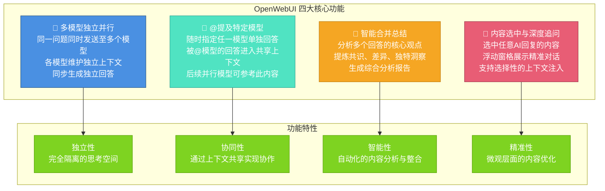

---

#### 独立思考，同步输出：并行工作流揭秘

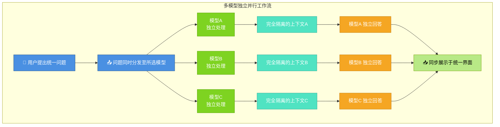

---

### 精准指挥，深度协作：像管理团队一样与 AI 对话

#### “@”一下，指定专家：随时调用特定模型

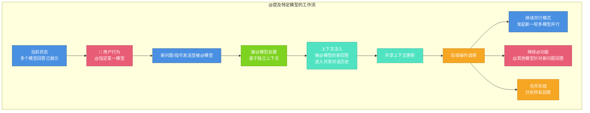

#### 知识的传递：通过上下文注入实现 AI 间协作

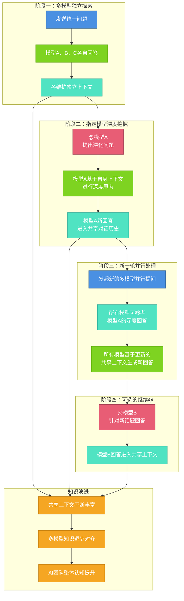

---

### 去粗取精，洞见未来：一键生成多维智能分析

#### 化繁为简：智能合并总结的工作流程

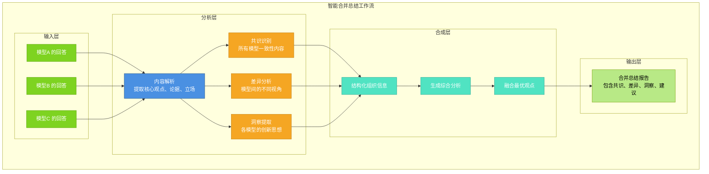

---

### 微观雕琢，极致优化：对 AI 的每一句话进行精准追问

#### 选中即追问：浮动窗格带来的“对话中的对话”

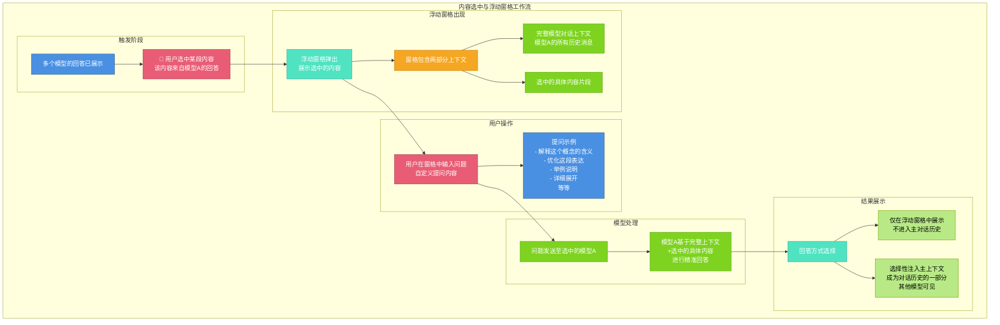

#### 临时讨论或永久记录：灵活的上下文注入策略

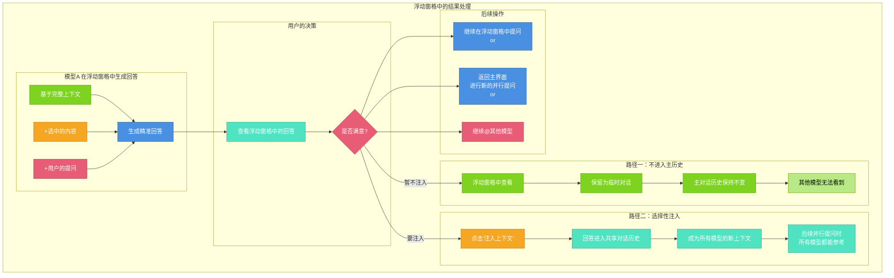

#### 从概念解释到内容批判：深度追问的无限可能

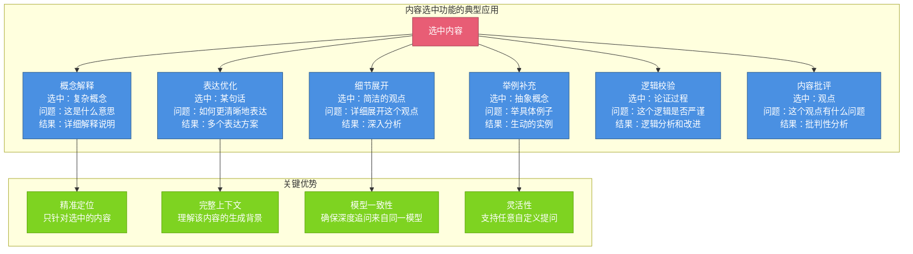

---

### 从创意到方案：掌握 OpenWebUI 高效工作流

#### 标准化力量：一个完整的工作流框架

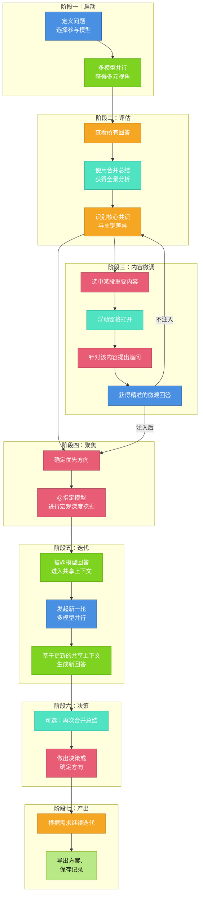

#### 灵活应变：根据任务复杂度动态调整

```mermaid
graph TD
    subgraph "简单任务路径"
        direction LR
        A["简单问题"] --> B["多模型并行"] --> C["查看回答"] --> D["快速决策"]
    end
    
    subgraph "需要微调优化的路径"
        direction LR
        E["初步回答需要优化"] --> F["选中特定内容"] --> G["浮动窗格精准优化<br/>如：表达改进<br/>细节补充<br/>概念解释"] --> H["选择性注入或保留"] --> I["继续主流程"]
    end
    
    subgraph "复杂任务路径"
        J["复杂问题"] --> K["多模型并行"] --> L["合并总结评估"] --> M{"需要深入某方向"}
        M --> N["@指定模型深化"]
        M --> O["选中内容精准追问"]
        N --> P["多轮迭代"]
        O --> P
        P -->|继续| M
        P -->|完成| Q["综合决策"]
    end
    
    style A fill:#4A90E2,stroke:#2E5C8A,color:#fff
    style E fill:#4A90E2,stroke:#2E5C8A,color:#fff
    style J fill:#4A90E2,stroke:#2E5C8A,color:#fff
    style D fill:#B8E986,stroke:#7BA30A,color:#000
    style Q fill:#B8E986,stroke:#7BA30A,color:#000
    style F fill:#E85D75,stroke:#A23E52,color:#fff
    style G fill:#50E3C2,stroke:#2EA896,color:#fff
    style H fill:#F5A623,stroke:#C27D0E,color:#fff
    style M fill:#E85D75,stroke:#A23E52,color:#fff
    style N fill:#E85D75,stroke:#A23E52,color:#fff
    style O fill:#E85D75,stroke:#A23E52,color:#fff
```

---

#### 功能协同，效果倍增：四大核心如何无缝配合

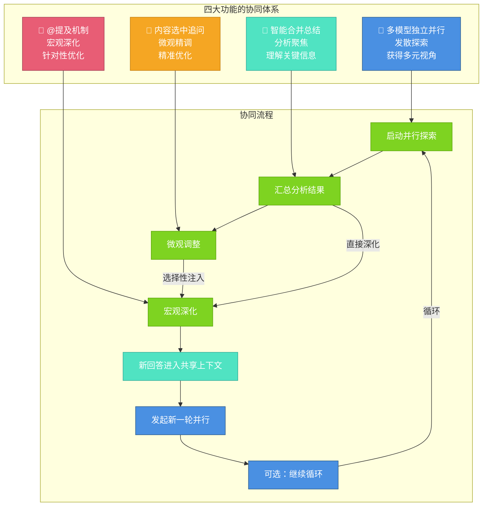

---

### 总结：OpenWebUI——您的私人 AI 智囊团

OpenWebUI 通过**多模型独立并行**、**@提及机制**、**智能合并总结**和**内容选中追问**四大功能的有机结合，构建了一个多维度、多层次的AI对话平台。

- **多模型并行**为用户提供了多元化的视角和创意
- **@提及机制**通过动态的上下文注入，实现了AI团队的宏观深度协作
- **智能合并总结**让用户快速掌握关键信息并做出决策
- **内容选中追问**通过浮动窗格实现了精准的微观层面优化

这四大功能的循环使用，既保持了广度的多元探索，又实现了深度的精准优化，能够帮助用户在宏观战略和微观细节之间实现完美平衡，最终获得融合多方优势、精致高效的精品方案。

## 第二部分：超越聊天的智能工作台——组织、知识与自动化

### 一、文件夹即项目：将对话空间转化为专业工作室

#### 从混乱到秩序：文件夹的三重身份

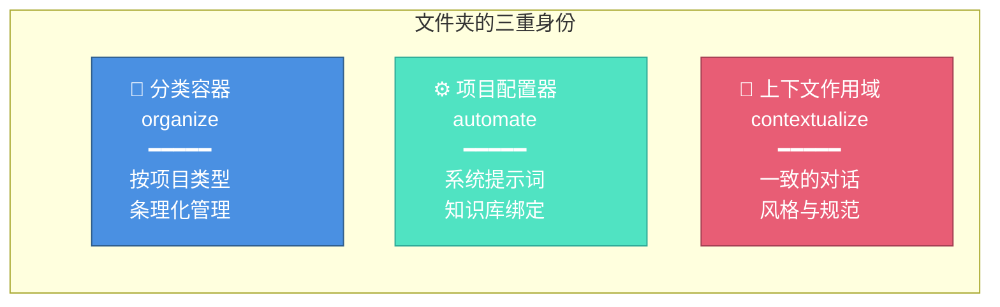

#### 工作流：如何在文件夹中建立专业工作环境

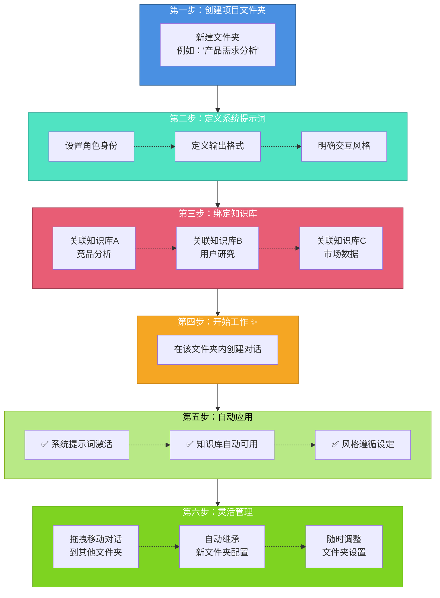

#### 真实应用示例：社交媒体内容创作工作室

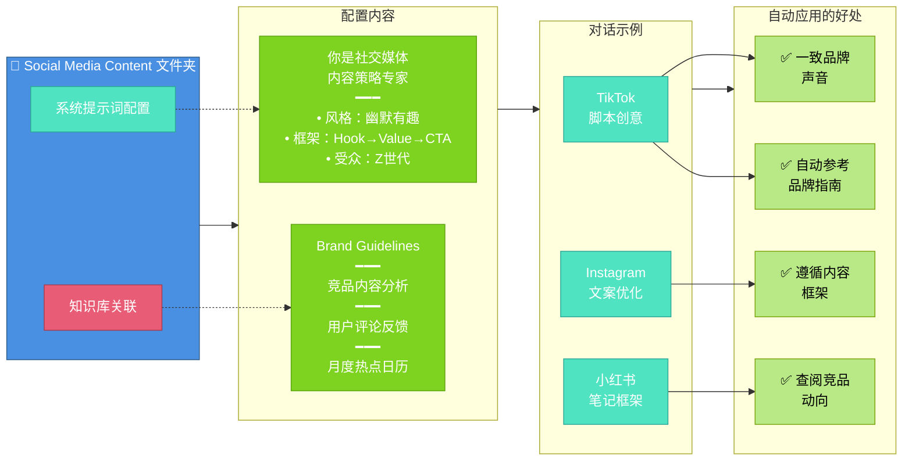

#### 文件夹管理的超级能力

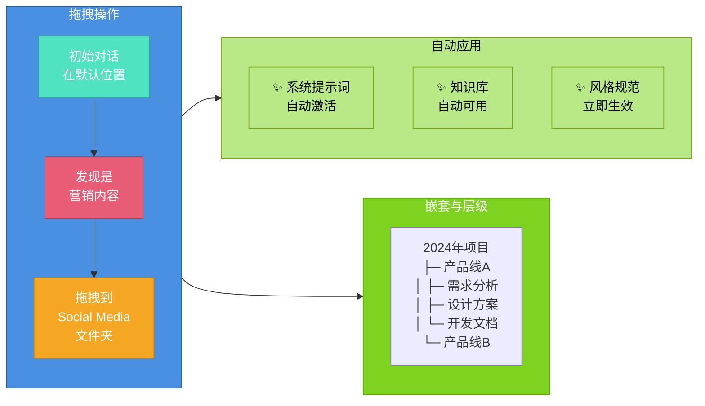

---

### 二、一切皆知识库：构建你的专业智库系统

#### 知识库的多源生态

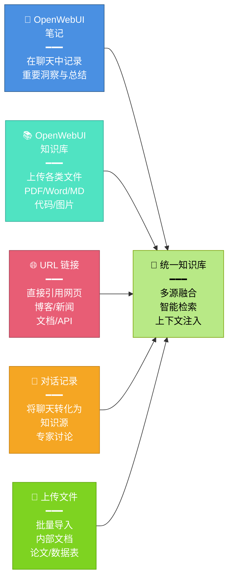

#### 知识库的使用工作流

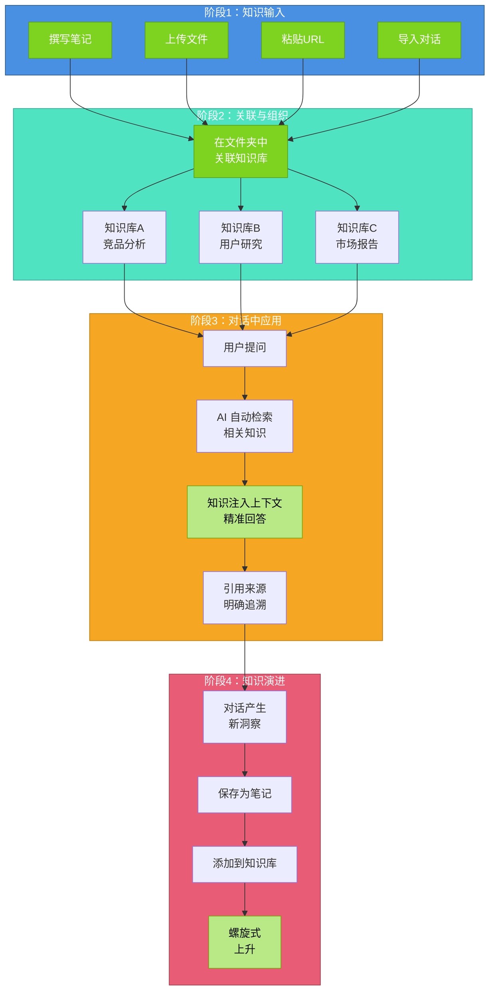

#### 应用示例对比

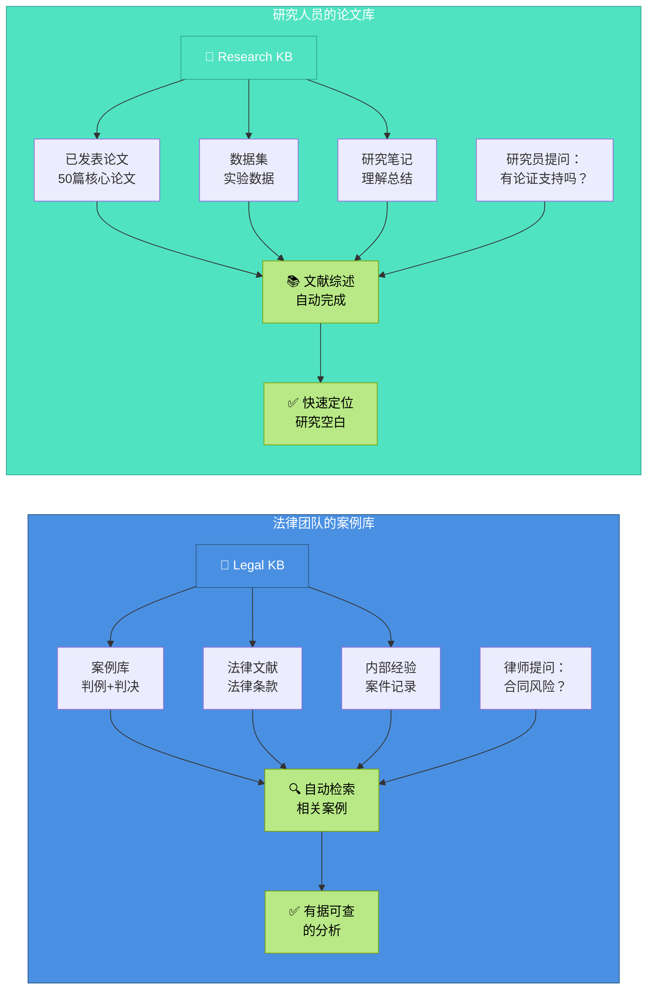

---

### 三、用户提示词：将即时需求转化为交互式表单

#### 什么是用户提示词？

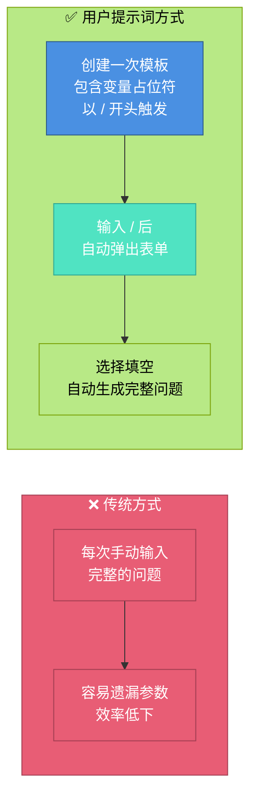

#### 用户提示词的工作流

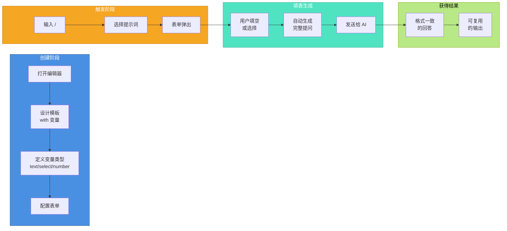

#### 三个实用模板示例

```mermaid
graph TB
    subgraph t1 ["📋 Template 1: Content Outline"]
        A1["输入：/content_outline"]
        A2["表单字段：<br/>• 主题 (textarea)<br/>• 类型 (select)<br/>• 受众 (select)<br/>• 长度 (select)<br/>• 要点数 (number)<br/>• 包含案例 (checkbox)<br/>• 语言风格 (select)"]
        A3["输出：<br/>论点 + 大纲 + 展开<br/>+ 案例 + 建议"]
    end
    
    subgraph t2 ["🔍 Template 2: Code Review"]
        B1["输入：/code_review"]
        B2["表单字段：<br/>• 编程语言 (select)<br/>• 审查焦点 (select)<br/>• 项目类型 (select)<br/>• 严格程度 (select)<br/>• 代码内容 (textarea)"]
        B3["输出：<br/>质量评分 + 风险<br/>+ 改进 + 优先级"]
    end
    
    subgraph t3 ["🧠 Template 3: Brainstorm"]
        C1["输入：/brainstorm"]
        C2["表单字段：<br/>• 主题 (textarea)<br/>• 目标 (select)<br/>• 参与者 (multi-select)<br/>• 限制条件 (textarea)<br/>• 创意数量 (number)<br/>• 分类维度 (select)"]
        C3["输出：<br/>多维创意 + 可行性<br/>+ 潜力评估 + 行动"]
    end
    
    A1 --> A2 --> A3
    B1 --> B2 --> B3
    C1 --> C2 --> C3
    
    style t1 fill:#4A90E2,stroke:#2E5C8A,color:#fff
    style t2 fill:#50E3C2,stroke:#2EA896,color:#fff
    style t3 fill:#E85D75,stroke:#A23E52,color:#fff
    style A3 fill:#B8E986,stroke:#7BA30A,color:#000
    style B3 fill:#B8E986,stroke:#7BA30A,color:#000
    style C3 fill:#B8E986,stroke:#7BA30A,color:#000
```

#### 用户提示词的五大优势

```mermaid
graph TB
    subgraph benefits ["用户提示词的核心优势"]
        A["🎯 精准性<br/>不遗漏参数<br/>提问完整清晰"]
        B["⚡ 高效性<br/>一次设置<br/>多次复用"]
        C["📋 一致性<br/>统一格式<br/>便于对标"]
        D["🧠 智能化<br/>表单引导思考<br/>降低失误"]
        E["🤝 协作性<br/>团队共享模板<br/>结果一致"]
    end
    
    style A fill:#4A90E2,stroke:#2E5C8A,color:#fff
    style B fill:#50E3C2,stroke:#2EA896,color:#fff
    style C fill:#E85D75,stroke:#A23E52,color:#fff
    style D fill:#F5A623,stroke:#C27D0E,color:#fff
    style E fill:#7ED321,stroke:#5BA30A,color:#fff
```

---

### 四、三大特性与四大核心功能的完整协同

```mermaid
graph TB
    subgraph components ["三大核心特性"]
        A["📁 文件夹<br/>项目工作室"]
        B["📚 知识库<br/>专业智库"]
        C["📋 用户提示词<br/>交互式模板"]
    end
    
    subgraph conversation ["四大对话功能"]
        D["🔶 多模型并行"]
        E["🔷 @提及深化"]
        F["🔹 合并总结"]
        G["🔸 内容选中追问"]
    end
    
    subgraph workflow ["完整工作流"]
        H["产品经理<br/>创建文件夹"]
        I["配置系统提示词"]
        J["关联知识库"]
        K["创建 /feature_analysis"]
        L["工作时输入 /"]
        M["填表自动生成"]
        N["并行发送多模型<br/>对比 → 深化 → 优化"]
        O["高质量方案"]
    end
    
    A --> H
    B --> J
    C --> K
    
    D --> N
    E --> N
    F --> N
    G --> N
    
    H --> I --> J --> K --> L --> M --> N --> O
    
    style A fill:#4A90E2,stroke:#2E5C8A,color:#fff
    style B fill:#50E3C2,stroke:#2EA896,color:#fff
    style C fill:#F5A623,stroke:#C27D0E,color:#fff
    style D fill:#4A90E2,stroke:#2E5C8A,color:#fff
    style E fill:#50E3C2,stroke:#2EA896,color:#fff
    style F fill:#E85D75,stroke:#A23E52,color:#fff
    style G fill:#7ED321,stroke:#5BA30A,color:#fff
    style O fill:#B8E986,stroke:#7BA30A,color:#000
```

---

## 总结：OpenWebUI 的独特价值主张

```mermaid
graph LR
    subgraph org ["📁 组织管理"]
        A["文件夹即项目<br/>自动应用配置"]
    end
    
    subgraph know ["📚 知识体系"]
        B["多源知识库<br/>智能检索注入"]
    end
    
    subgraph eff ["⚡ 工作效率"]
        C["交互式提示词<br/>复杂需求简化"]
    end
    
    subgraph quality ["🎯 对话品质"]
        D["四大核心功能<br/>完整协同流程"]
    end
    
    subgraph value ["💎 最终价值"]
        E["从混乱到秩序<br/>从碎片到系统<br/>从重复到高效<br/>从单一到多元<br/>━━━<br/>构建真正的<br/>AI 智囊团"]
    end
    
    A --> value
    B --> value
    C --> value
    D --> value
    
    style org fill:#4A90E2,stroke:#2E5C8A,color:#fff
    style know fill:#50E3C2,stroke:#2EA896,color:#fff
    style eff fill:#F5A623,stroke:#C27D0E,color:#fff
    style quality fill:#E85D75,stroke:#A23E52,color:#fff
    style value fill:#B8E986,stroke:#7BA30A,color:#000
```

---

### 对比表：OpenWebUI vs 其他工具

| 维度 | OpenWebUI | 其他工具 |
|------|-----------|---------|
| **项目组织** | 📁 文件夹即项目 + 自动配置 | 文件夹只用于分类 |
| **知识来源** | 📚 笔记 + 文件 + URL + 对话 | 主要是文件上传 |
| **知识应用** | 自动检索 + 智能注入 | 需要手动引用 |
| **提示词管理** | 📋 文件夹级 + 交互式表单 | 通常无模板系统 |
| **多模型协同** | 🔶🔷🔹🔸 四大核心功能 | 基础的多模型切换 |
| **开源友好度** | ⭐⭐⭐⭐⭐ 高度可定制 | 部分不开源 |

## 第三部分：精细化模型管理——自定义模型功能

### 一、自定义模型配置：打造专属的 AI 助手

OpenWebUI 提供了强大的模型自定义功能，允许用户精细化配置每个模型的行为、权限和能力，满足不同场景下的专业需求。

#### 自定义模型的核心配置项

```mermaid
graph TB
    subgraph core ["核心配置维度"]
        A["👥 用户权限<br/>━━━<br/>控制模型可见性<br/>设置使用权限"]
        
        B["🏷️ 模型标签<br/>━━━<br/>分类管理<br/>快速筛选"]
        
        C["📝 系统提示词<br/>━━━<br/>定义角色与风格<br/>预设行为规范"]
        
        D["⚙️ 接口参数<br/>━━━<br/>通用参数配置<br/>自定义请求参数"]
    end
    
    subgraph enhance ["增强功能"]
        E["💡 提示词建议<br/>━━━<br/>智能补全<br/>场景化推荐"]
        
        F["📚 知识库绑定<br/>━━━<br/>专业领域知识<br/>自动检索注入"]
        
        G["🛠️ 可用工具<br/>━━━<br/>函数调用<br/>API 集成"]
    end
    
    subgraph plugin ["插件系统"]
        H["🔍 过滤器<br/>━━━<br/>输入预处理<br/>内容过滤"]
        
        I["⚡ 操作<br/>━━━<br/>自定义功能<br/>外部调用"]
    end
    
    subgraph ability ["能力配置"]
        J["🎯 模型能力<br/>━━━<br/>对话/生成<br/>分析/总结"]
        
        K["🌐 默认功能<br/>━━━<br/>联网搜索<br/>图像生成"]
    end
    
    style A fill:#4A90E2,stroke:#2E5C8A,color:#fff
    style B fill:#50E3C2,stroke:#2EA896,color:#fff
    style C fill:#E85D75,stroke:#A23E52,color:#fff
    style D fill:#F5A623,stroke:#C27D0E,color:#fff
    style E fill:#7ED321,stroke:#5BA30A,color:#fff
    style F fill:#B8E986,stroke:#7BA30A,color:#000
    style G fill:#4A90E2,stroke:#2E5C8A,color:#fff
    style H fill:#50E3C2,stroke:#2EA896,color:#fff
    style I fill:#E85D75,stroke:#A23E52,color:#fff
    style J fill:#F5A623,stroke:#C27D0E,color:#fff
    style K fill:#7ED321,stroke:#5BA30A,color:#fff
```

---

#### 模型配置工作流

```mermaid
graph LR
    subgraph setup ["配置阶段"]
        A["选择/添加模型"] --> B["设置基础信息"]
        B --> C["配置权限与标签"]
        C --> D["定义系统提示词"]
    end
    
    subgraph enhance ["增强阶段"]
        E["配置接口参数"] --> F["关联知识库"]
        F --> G["添加可用工具"]
        G --> H["启用过滤器/操作"]
    end
    
    subgraph ability ["能力阶段"]
        I["设置提示词建议"] --> J["配置默认功能"]
        J --> K["定义模型能力"]
    end
    
    subgraph deploy ["部署使用"]
        L["保存配置"] --> M["分配给用户/团队"]
        M --> N["开始使用"]
    end
    
    setup --> enhance
    enhance --> ability
    ability --> deploy
    
    style setup fill:#4A90E2,stroke:#2E5C8A,color:#fff
    style enhance fill:#50E3C2,stroke:#2EA896,color:#fff
    style ability fill:#F5A623,stroke:#C27D0E,color:#fff
    style deploy fill:#B8E986,stroke:#7BA30A,color:#000
```

---

### 二、关键配置项详解

#### 1. 用户权限与模型标签

```mermaid
graph TB
    subgraph permission ["👥 用户权限管理"]
        A["公开模型<br/>所有用户可见"]
        B["团队模型<br/>特定团队可用"]
        C["私有模型<br/>仅限管理员"]
    end
    
    subgraph tag ["🏷️ 标签分类"]
        D["按用途分类<br/>客服/写作/编程"]
        E["按能力分类<br/>文本/多模态/代码"]
        F["按场景分类<br/>内部/外部/测试"]
    end
    
    subgraph benefit ["优势"]
        G["✅ 精准权限控制<br/>✅ 快速查找定位<br/>✅ 有序组织管理"]
    end
    
    A --> G
    B --> G
    C --> G
    D --> G
    E --> G
    F --> G
    
    style permission fill:#4A90E2,stroke:#2E5C8A,color:#fff
    style tag fill:#50E3C2,stroke:#2EA896,color:#fff
    style benefit fill:#B8E986,stroke:#7BA30A,color:#000
```

#### 2. 系统提示词与接口参数

```mermaid
graph LR
    subgraph prompt ["📝 系统提示词"]
        A["角色定义<br/>━━━<br/>你是...专家<br/>专注于...领域"]
        
        B["行为规范<br/>━━━<br/>回答风格<br/>输出格式"]
        
        C["约束条件<br/>━━━<br/>不要...<br/>必须..."]
    end
    
    subgraph params ["⚙️ 接口参数"]
        D["通用参数<br/>━━━<br/>temperature<br/>top_p<br/>max_tokens"]
        
        E["自定义参数<br/>━━━<br/>特殊 headers<br/>请求体结构<br/>认证方式"]
    end
    
    subgraph result ["效果"]
        F["一致的模型行为"]
        G["精准的输出控制"]
    end
    
    A --> F
    B --> F
    C --> F
    D --> G
    E --> G
    
    style prompt fill:#E85D75,stroke:#A23E52,color:#fff
    style params fill:#F5A623,stroke:#C27D0E,color:#fff
    style result fill:#B8E986,stroke:#7BA30A,color:#000
```

#### 3. 增强功能：知识库、工具与插件

```mermaid
graph TB
    subgraph kb ["📚 知识库集成"]
        A["绑定专业知识库"]
        B["自动检索相关内容"]
        C["增强回答准确性"]
    end
    
    subgraph tool ["🛠️ 工具集成"]
        D["函数调用<br/>Function Calling"]
        E["API 接口<br/>外部服务"]
        F["实时数据<br/>动态查询"]
    end
    
    subgraph plugin ["🔌 插件系统"]
        G["过滤器 Filter<br/>━━━<br/>输入预处理<br/>内容过滤<br/>上下文压缩"]
        
        H["操作 Action<br/>━━━<br/>保存到文件<br/>调用 API<br/>自定义功能"]
    end
    
    subgraph flow ["工作流程"]
        I["用户输入"]
        J["过滤器处理"]
        K["知识库检索"]
        L["工具调用"]
        M["模型生成"]
        N["操作执行"]
        O["返回结果"]
    end
    
    I --> J --> K --> L --> M --> N --> O
    
    style kb fill:#4A90E2,stroke:#2E5C8A,color:#fff
    style tool fill:#50E3C2,stroke:#2EA896,color:#fff
    style plugin fill:#E85D75,stroke:#A23E52,color:#fff
    style flow fill:#F5A623,stroke:#C27D0E,color:#fff
```

---

### 三、实战应用场景

#### 场景示例：客服专用模型配置

```mermaid
graph TB
    subgraph config ["配置内容"]
        A["🏷️ 标签<br/>客服/支持/FAQ"]
        
        B["👥 权限<br/>客服团队可见"]
        
        C["📝 系统提示词<br/>你是专业客服<br/>友好、耐心、专业<br/>总是提供解决方案"]
        
        D["📚 知识库<br/>产品手册<br/>常见问题<br/>解决方案库"]
        
        E["🛠️ 工具<br/>工单系统<br/>用户数据查询<br/>库存查询"]
        
        F["🔍 过滤器<br/>敏感信息过滤<br/>语气优化"]
        
        G["⚡ 操作<br/>创建工单<br/>发送邮件"]
        
        H["🌐 默认功能<br/>启用联网查询"]
    end
    
    subgraph effect ["使用效果"]
        I["✅ 专业响应<br/>✅ 知识准确<br/>✅ 自动化操作<br/>✅ 统一服务标准"]
    end
    
    A --> effect
    B --> effect
    C --> effect
    D --> effect
    E --> effect
    F --> effect
    G --> effect
    H --> effect
    
    style config fill:#4A90E2,stroke:#2E5C8A,color:#fff
    style effect fill:#B8E986,stroke:#7BA30A,color:#000
```

#### 场景示例：代码助手模型配置

```mermaid
graph LR
    subgraph codemodel ["代码助手配置"]
        A["系统提示词<br/>━━━<br/>专业程序员<br/>详细注释<br/>最佳实践"]
        
        B["知识库<br/>━━━<br/>项目文档<br/>API 文档<br/>编码规范"]
        
        C["工具<br/>━━━<br/>代码执行<br/>linter<br/>测试运行器"]
        
        D["能力<br/>━━━<br/>代码生成<br/>重构<br/>bug 修复"]
    end
    
    subgraph workflow ["工作流"]
        E["需求描述"]
        F["知识库查询"]
        G["代码生成"]
        H["自动测试"]
        I["返回结果"]
    end
    
    E --> F --> G --> H --> I
    
    style codemodel fill:#50E3C2,stroke:#2EA896,color:#fff
    style workflow fill:#F5A623,stroke:#C27D0E,color:#fff
```

---

### 四、配置最佳实践

```mermaid
graph TB
    subgraph practice ["配置建议"]
        A["🎯 明确定位<br/>━━━<br/>清晰的角色定义<br/>专注特定场景"]
        
        B["📝 精炼提示词<br/>━━━<br/>简洁明确<br/>避免冲突指令"]
        
        C["📚 合理关联<br/>━━━<br/>知识库按需绑定<br/>避免信息过载"]
        
        D["🛠️ 渐进增强<br/>━━━<br/>先基础后高级<br/>逐步添加功能"]
        
        E["🔍 持续优化<br/>━━━<br/>根据反馈调整<br/>迭代改进配置"]
        
        F["👥 权限合理<br/>━━━<br/>最小权限原则<br/>按需分配"]
    end
    
    subgraph tips ["关键要点"]
        G["✓ 一个模型一个用途<br/>✓ 提示词避免过于复杂<br/>✓ 工具按需启用<br/>✓ 定期审查配置<br/>✓ 测试后再推广"]
    end
    
    practice --> tips
    
    style practice fill:#4A90E2,stroke:#2E5C8A,color:#fff
    style tips fill:#B8E986,stroke:#7BA30A,color:#000
```

---

### 总结：自定义模型的价值

通过 OpenWebUI 的自定义模型功能，您可以：

- **🎯 精准控制**：细粒度的权限管理和行为定制
- **📚 知识增强**：无缝集成专业知识库，提升准确性
- **🛠️ 功能扩展**：通过工具和插件实现复杂业务流程
- **⚡ 提升效率**：一次配置，多次复用，标准化输出
- **👥 团队协作**：统一的模型配置，保证服务一致性

自定义模型功能将 OpenWebUI 从简单的对话工具升级为可深度定制的 AI 工作平台，满足从个人使用到企业级部署的各类需求。
