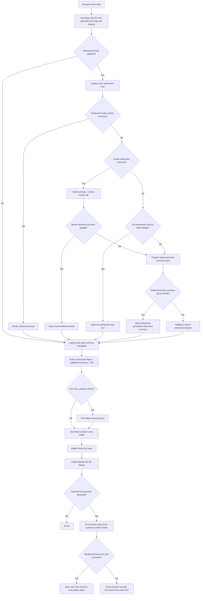

# Async Context Compression Filter

| By [Fu-Jie](https://github.com/Fu-Jie) · v1.7.2 | [⭐ Star this repo](https://github.com/Fu-Jie/openwebui-extensions) |
| :--- | ---: |

|  |  |  |  |  |  |  |
| :---: | :---: | :---: | :---: | :---: | :---: | :---: |

This filter reduces token consumption in long conversations through intelligent summarization and message compression while keeping conversations coherent.

## Install with Batch Install Plugins

If you already use [Batch Install Plugins from GitHub](https://openwebui.com/posts/batch_install_plugins_install_popular_plugins_in_s_c9fd6e80) , you can install or update this plugin with:

```text
Install plugin from Fu-Jie/openwebui-extensions
```

When the selection dialog opens, search for this plugin, check it, and continue.

> [!IMPORTANT]
> If the official OpenWebUI Community version is already installed, remove it first. After that, Batch Install Plugins can keep this plugin updated in future runs.

## Branch-aware summary reuse

- **Branch-safe cached summaries**: Stored summaries are reused only when every saved message-id + payload-fingerprint ref can be explained as either a current active-branch ancestor or a message proven deleted from the full history graph. Summary rows that still contain live sibling-branch refs are rejected, so new or edited current-branch messages stay in the raw live tail instead of being hidden by an old summary.
- **Single-table persistence**: Branch-specific reusable coverage is stored as multiple rows in `chat_summary`; there is no separate current-pointer row. Branch-valid historical rows are retained so a future fork can reuse the nearest matching ancestor, even when the user branches from an older point.
- **Protected-head tracking**: Summary rows remember how many leading messages were kept outside the summary. If the current `keep_first` policy no longer preserves those messages, the row is not reused as branch-valid coverage.
- **Safe upgrade behavior**: Legacy summaries without coverage metadata are not trusted as coverage. The first turn after upgrading may send more raw context until a branch-valid summary row is generated.

## What's new in 1.7.2

- **Summary injection safety guard**: Injected summaries now explicitly state that goals, open loops, and tool state inside the summary are historical context only, not new instructions.
- **Stale next-reply guidance removal**: The filter strips `<next_reply_guidance>` blocks before summaries become model-visible context, preventing old summary guidance from steering a later request.
- **Locale-wide guard coverage**: The historical-summary warning is applied consistently across all supported summary prompt translations.
- **Safer referenced chat summaries**: Cached, partial, and newly generated referenced-chat summaries now receive the same guard and stale-guidance stripping as main chat summaries.
- **Regression coverage**: Tests cover normal summary injection, every translation locale, cached referenced summaries, mixed summary plus raw tail references, and generated referenced summaries.

## What's new in 1.7.1

- **Branch-aware summary reuse**: Cached summaries are validated against ordered message refs and payload fingerprints before reuse, so sibling-branch or edited-history summaries are not injected into the wrong branch.
- **Single-table summary storage**: Branch-valid historical rows are stored directly in `chat_summary`; all branch summaries live in that table.
- **Branch-aware referenced chats**: Referenced chats can now reuse the largest valid prefix summary plus the uncovered active-branch tail. If that mixed reference needs a new summary, the continuation summary is saved back to `chat_summary` for the referenced chat and reused later.
- **Idless request summary reuse**: Request bodies without stable message ids can now be matched against the persisted DB active branch before rejecting cached summaries, preventing long chats from falling back to raw history unnecessarily.
- **Terminal assistant placeholder handling**: When OpenWebUI has inserted the in-progress assistant placeholder into the DB branch but the model-visible request ends at the latest user message, the filter can ignore that terminal placeholder only after the body proves it matches the user-tip branch.
- **Safer schema and DB fallback behavior**: Legacy count-only summaries are not trusted as coverage, old one-row-per-chat schemas are rebuilt safely, folded output conversion failures fail closed, and debug logging is safe for idless fallback.

## What's new in 1.6.4

- **Robust summary response parsing**: Background summary generation now extracts text from several provider response shapes, including standard `choices[].message.content`, content-part arrays with `output_text`, and Responses-style `output` message items.
- **Reasoning-safe persistence**: Reasoning-only fields such as `reasoning_content`, `thinking`, and reasoning output items are ignored so private chain-of-thought is not persisted as chat memory.
- **Clearer empty-summary diagnostics**: If the summary provider returns no usable text, the filter now reports the compact response shape instead of surfacing a misleading generic format error.

## What's new in 1.5.0

- **External Chat Reference Summaries**: Added support for referenced chat context blocks that can reuse cached summaries, inject small referenced chats directly, or generate summaries for larger referenced chats before injection.
- **Fast Multilingual Token Estimation**: Added a new mixed-script token estimation pipeline so inlet/outlet preflight checks can avoid unnecessary exact token counts while staying much closer to real usage.
- **Stronger Working-Memory Prompt**: Refined the XML summary prompt to better preserve actionable context across general chat, coding tasks, and tool-heavy conversations.
- **Clearer Frontend Debug Logs**: Reworked browser-console logging into grouped structural snapshots that are easier to scan during debugging.
- **Safer Tool Trimming Defaults**: Enabled native tool-output trimming by default and exposed a dedicated `tool_trim_threshold_chars` valve with a 600-character default.
- **Safer Referenced-Chat Fallbacks**: If generating a referenced chat summary fails, the new reference-summary path now falls back to direct contextual injection instead of failing the whole chat.
- **Correct Summary Budgeting**: `summary_model_max_context` now controls summary-input fitting, while `max_summary_tokens` remains an output-length cap.
- **More Visible Summary Failures**: Important background summary failures now surface in the browser console (`F12`) and as a status hint even when `show_debug_log` is off.

---

## Core Features

- ✅ **Full i18n Support**: Native localization across 9 languages.
- ✅ Automatic compression triggered by token thresholds.
- ✅ Asynchronous summarization that does not block chat responses.
- ✅ Persistent storage via Open WebUI's shared database connection (PostgreSQL, SQLite, etc.).
- ✅ Flexible retention policy to keep the first and last N messages.
- ✅ Branch-aware injection of historical summaries back into the context.
- ✅ External chat reference summarization with branch-valid full summaries, partial summary + active-branch tail reuse, direct injection for small chats, and persisted generated summaries for larger chats.
- ✅ Structure-aware trimming that preserves document structure (headers, intro, conclusion).
- ✅ Native tool output trimming for cleaner context when using function calling.
- ✅ Configurable compression style for token-minimal, balanced, or high-fidelity summaries.
- ✅ Real-time context usage monitoring with warning notifications (>90%).
- ✅ Fast multilingual token estimation plus exact token fallback for precise debugging and optimization.
- ✅ **Smart Model Matching**: Automatically inherits configuration from base models for custom presets.
- ⚠ **Multimodal Support**: Images are preserved but their tokens are **NOT** calculated. Please adjust thresholds accordingly.

---

## What This Fixes

- **Problem: System Messages being summarized/lost.**
  Previously, the filter could include system messages (especially those injected late by other plugins) in its summarization zone, causing important instructions to be lost. Now, all system messages are strictly preserved in their original role and never summarized.
- **Problem: Incorrect `keep_first` behavior.**
  Previously, `keep_first` simply took the first $N$ messages. If those were only system messages, the initial user/assistant messages (which are often important for context) would be summarized. Now, `keep_first` ensures that $N$ non-system messages are protected.
- **Problem 1: A referenced chat could break the current request.**
  Before, if the filter needed to summarize a referenced chat and that LLM call failed, the current chat could fail with it. Now it degrades gracefully and injects direct context instead.
- **Problem 2: Some referenced chats were being cut too aggressively.**
  Before, the output limit (`max_summary_tokens`) could be treated like the input window, which made large referenced chats shrink earlier than necessary. Now input fitting uses the summary model's real context window (`summary_model_max_context` or model/global fallback).
- **Problem 3: Some background summary failures were too easy to miss.**
  Before, a failure during background summary preparation could disappear quietly when frontend debug logging was off. Now important failures are forced to the browser console and also shown through a user-facing status message.

---

## Workflow Overview

This filter operates in two phases:

1. `inlet`: injects stored summaries, processes external chat references, and trims context when required before the request is sent to the model.
2. `outlet`: runs asynchronously after the response is complete, decides whether a new summary should be generated, and persists it when appropriate.



### Key Notes

- `inlet` only injects and trims context. It does not generate the main chat summary.
- `outlet` performs summary generation asynchronously and does not block the current reply.
- External chat references use the referenced chat's saved active branch (`history.currentId`). The reference attachment does not choose a separate branch.
- External chat references may come from an existing full branch-valid summary, a partial branch-valid summary plus uncovered active-branch tail, a small chat's full text, or a generated/truncated reference summary.
- `chat_summary` stores branch-valid summary rows with message refs. Legacy count-only `chat_summary` schemas are rebuilt on startup because they do not contain enough coverage metadata to reuse safely.
- When a referenced-chat continuation summary is generated from an existing cached summary plus raw tail, it is saved back to the referenced chat's `chat_summary` row coverage so future references can reuse it.
- If a referenced-chat summary call fails, the filter falls back to direct context injection instead of failing the whole request.
- Branch-valid historical summary rows are retained so a future branch can reuse the nearest matching ancestor summary, even when the user forks at an arbitrary earlier point.
- `summary_model_max_context` controls summary-input fitting. `max_summary_tokens` only controls how long the generated summary may be, and it must be less than 80% of the summary model input window. This reserve ensures a future compression pass can feed the previous summary plus at least some new messages into the summary model; if the old summary can fill the whole input window by itself, another compression pass cannot make meaningful progress. Invalid settings raise a configuration error; the filter does not silently lower the value.
- Important background summary failures are surfaced to the browser console (`F12`) and the chat status area.
- External reference messages are protected during trimming so they are not discarded first.

---

## Installation & Configuration

### 1) Database (automatic)

- Uses Open WebUI's shared database connection; no extra configuration needed.
- The branch-aware `chat_summary` table is created on first run. Older count-only `chat_summary` tables, or tables that still enforce one row per chat with a unique `chat_id`, are rebuilt so summaries can be regenerated safely. If the plugin cannot inspect the existing schema, it leaves the tables untouched and disables summary persistence instead of running destructive DDL.

### 2) Filter order

- Recommended order: pre-filters (<10) → this filter (10) → post-filters (>10).

---

## Configuration Parameters

| Parameter                      | Default  | Description                                                                                                                                                           |
| :----------------------------- | :------- | :-------------------------------------------------------------------------------------------------------------------------------------------------------------------- |
| `priority`                     | `10`     | Execution order; lower runs earlier.                                                                                                                                  |
| `compression_threshold_tokens` | `64000`  | Trigger asynchronous summary when total tokens exceed this value. Set to 50%-70% of your model's context window.                                                      |
| `max_context_tokens`           | `128000` | Hard cap for context; older messages (except protected ones) are dropped if exceeded.                                                                                 |
| `keep_first`                   | `0`      | Number of initial **non-system** messages to always keep (plus all preceding system prompts).                                                                         |
| `keep_last`                    | `6`      | Always keep the last N messages to preserve recent context.                                                                                                           |
| `summary_model`                | `None`   | Model for summaries. Strongly recommended to set a fast, economical model (e.g., `gemini-2.5-flash`, `deepseek-v3`). Falls back to the current chat model when empty. |
| `summary_model_max_context`    | `0`      | Input context window used to fit summary requests. If `0`, falls back to `model_thresholds` or global `max_context_tokens`.                                          |
| `max_summary_tokens`           | `16384`  | Maximum output length for the generated summary. This is not the summary-input context limit, and must be strictly less than 80% of the effective summary input window (`summary_model_max_context`, or its fallback from `model_thresholds` / `max_context_tokens`). The remaining window is reserved so the next compression can include the previous summary plus new messages; invalid settings raise an error instead of being auto-adjusted. |
| `summary_llm_timeout_seconds`  | `180.0`  | Maximum time to wait for the summary LLM request before skipping summary generation for that turn. Set to `0` to disable the timeout.                                 |
| `summary_temperature`          | `0.1`    | Randomness for summary generation. Lower is more deterministic.                                                                                                       |
| `summary_fail_mode`            | `silent` | Controls what happens when the summary LLM call fails. `silent` logs the error and skips summary generation for that turn; `raise` preserves the previous hard-failure behavior. |
| `compression_style`            | `balanced` | Controls summary compactness. `aggressive` minimizes tokens, `balanced` keeps key context with moderate detail, and `faithful` preserves more nuance and reasoning context. |
| `model_thresholds`             | `{}`     | Per-model overrides for `compression_threshold_tokens` and `max_context_tokens` (useful for mixed models).                                                            |
| `enable_tool_output_trimming`  | `true`   | When enabled for `function_calling: "native"`, trims oversized native tool outputs while keeping the tool-call chain intact.                                          |
| `tool_trim_threshold_chars`     | `600`    | Trim native tool output blocks once their total content length reaches this threshold.                                                                                 |
| `debug_mode`                   | `false`  | Log verbose debug info. Set to `false` in production.                                                                                                                 |
| `show_debug_log`               | `false`  | Print debug logs to browser console (F12). Useful for frontend debugging.                                                                                             |
| `show_token_usage_status`      | `true`   | Show token usage status notification in the chat interface.                                                                                                           |
| `token_usage_status_threshold` | `80`     | The minimum usage percentage (0-100) required to show a context usage status notification.                                                                            |

---

## ⭐ Support

If this plugin has been useful, a star on [OpenWebUI Extensions](https://github.com/Fu-Jie/openwebui-extensions) is a big motivation for me. Thank you for the support.

## Troubleshooting ❓

- **Initial system prompt is lost**: Keep `keep_first` greater than 0 to protect the initial message.
- **Compression effect is weak**: Raise `compression_threshold_tokens` or lower `keep_first` / `keep_last` to allow more aggressive compression.
- **A referenced chat summary fails**: The current request should continue with a direct-context fallback. Check the browser console (`F12`) if you need the upstream failure details.
- **A background summary silently seems to do nothing**: Important failures now surface in chat status and the browser console (`F12`).
- **`Summary generation returned empty result` appears after the LLM call succeeds**: Update or reinstall the filter so the database-stored function content matches v1.6.4 or later. This release can parse alternate provider response shapes, but it intentionally ignores reasoning-only output. If the model returns only `reasoning_content` / `thinking` without a final answer, the browser console will show the response shape and nothing will be saved as memory.
- **Summaries are too short or too detailed**: Adjust `compression_style`. Use `aggressive` for maximum token savings, `balanced` for the default tradeoff, or `faithful` when preserving reasoning context and active alternatives matters more than brevity.
- **Submit an Issue**: If you encounter any problems, please submit an issue on GitHub: [OpenWebUI Extensions Issues](https://github.com/Fu-Jie/openwebui-extensions/issues)

## Changelog

See [`v1.7.2` Release Notes](https://github.com/Fu-Jie/openwebui-extensions/blob/main/plugins/filters/async-context-compression/v1.7.2.md) for the release-specific summary.

See the full history on GitHub: [OpenWebUI Extensions](https://github.com/Fu-Jie/openwebui-extensions)
