# 从"问一个AI"到"运营一支AI团队"

## 解读OpenWebUI的协同野心与平台价值

---

## 核心理念

从与一个AI对话，到指挥一支多模型协作的AI团队——这不仅仅是工具的升级，更是工作方式的革命。

OpenWebUI通过 **协同、扩展、定制、生态** 四大维度，将AI从辅助工具升级为智囊团和工作平台。

---

# 第一部分：构建AI团队的基础
## ——多模型协同对话系统

---

### Part 1.1: 思想的交响乐：体验多模型并行的力量

**告别选择困难：让多个 AI 同时为您服务**

```mermaid
graph TB
    subgraph "OpenWebUI 四大核心功能"
        A["🔶 多模型独立并行<br/>同一问题同时发送至多个模型<br/>各模型维护独立上下文<br/>同步生成独立回答"]
        B["🔷 @提及特定模型<br/>随时指定任一模型单独回答<br/>被@模型的回答进入共享上下文<br/>后续并行模型可参考此内容"]
        C["🔹 智能合并总结<br/>分析多个回答的核心观点<br/>提炼共识、差异、独特洞察<br/>生成综合分析报告"]
        D["🔸 内容选中与深度追问<br/>选中任意AI回复的内容<br/>浮动窗格展示精准对话<br/>支持选择性的上下文注入"]
    end
    subgraph "功能特性"
        E["独立性"] F["协同性"] G["智能性"] H["精准性"]
    end
    A --> E; B --> F; C --> G; D --> H
```

---

#### 独立思考，同步输出：并行工作流揭秘

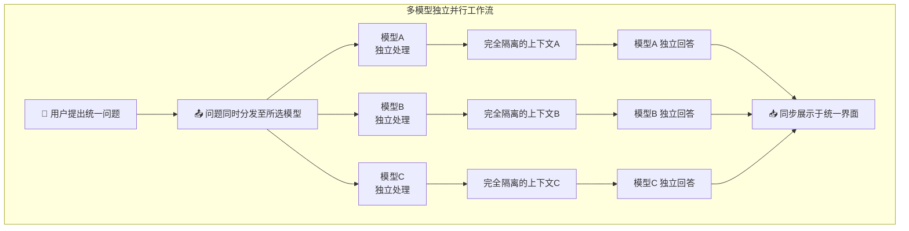

---

### Part 1.2: 精准指挥，深度协作
#### ——像管理团队一样与 AI 对话

**“@”一下，指定专家：随时调用特定模型**

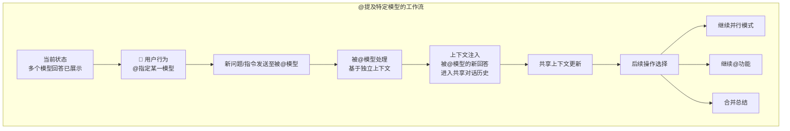
---

#### 知识的传递：通过上下文注入实现 AI 间协作

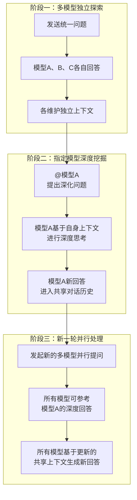

---

### Part 1.3: 去粗取精，洞见未来
#### ——一键生成多维智能分析

**化繁为简：智能合并总结的工作流程**

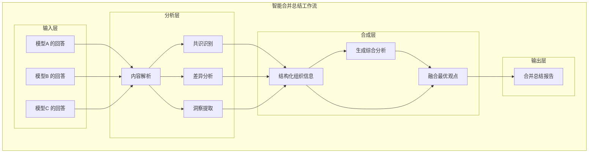

---

### Part 1.4: 微观雕琢，极致优化
#### ——对 AI 的每一句话进行精准追问

**选中即追问：浮动窗格带来的“对话中的对话”**

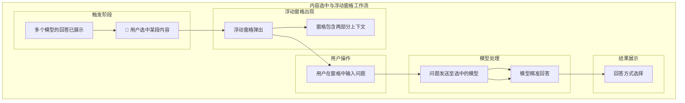

---

#### 从概念解释到内容批判：深度追问的无限可能

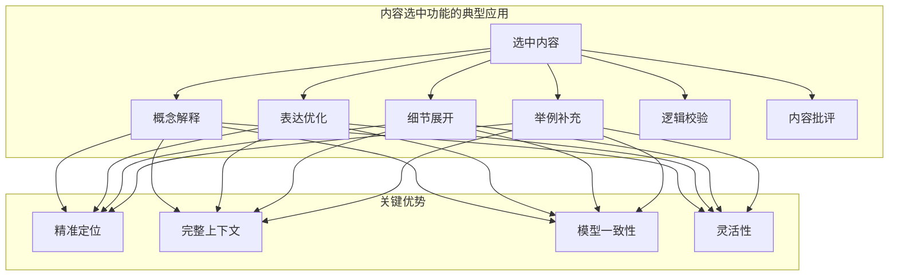

---

### Part 1.5: 从创意到方案：掌握 OpenWebUI 高效工作流

**一个完整的工作流框架**

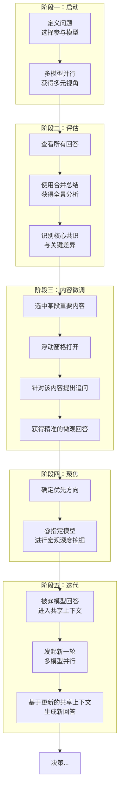

---

### 第一部分总结：OpenWebUI——您的私人 AI 智囊团

OpenWebUI 通过四大功能的有机结合，构建了一个多维度、多层次的AI对话平台。

- **多模型并行**：提供多元视角
- **@提及机制**：实现宏观深度协作
- **智能合并总结**：快速掌握关键信息
- **内容选中追问**：实现微观层面优化

**实现了广度探索与深度优化的完美平衡。**

---

# 第二部分：超越聊天的智能工作台
## ——组织、知识与自动化

---

### Part 2.1: 文件夹即项目
#### ——将对话空间转化为专业工作室

**文件夹的三重身份**
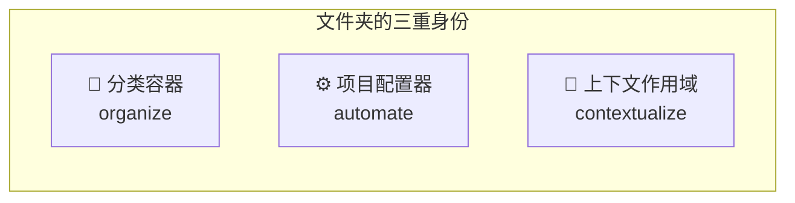

---

### Part 2.2: 一切皆知识库
#### ——构建你的专业智库系统

**知识库的多源生态**
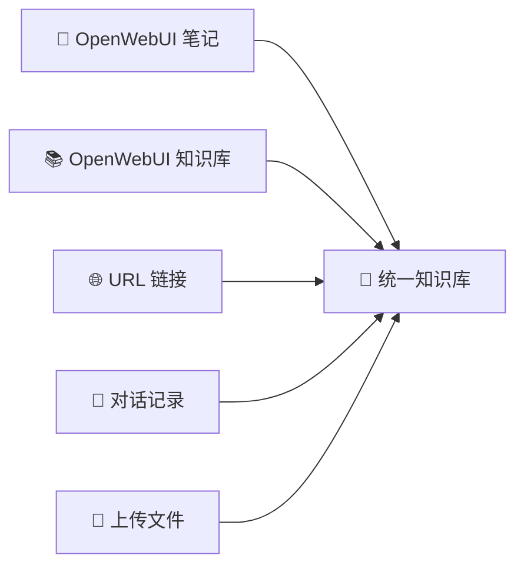

---

### Part 2.3: 用户提示词
#### ——将即时需求转化为交互式表单

**什么是用户提示词？**
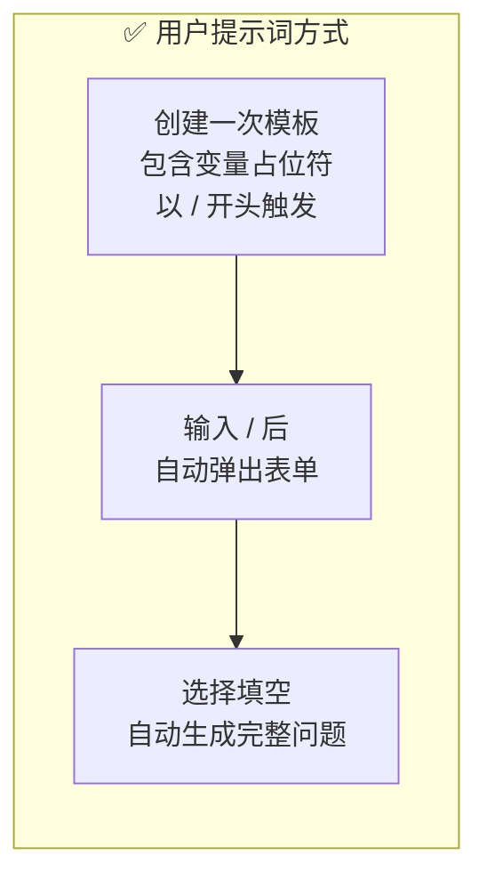
**优势：精准、高效、一致、智能、协作**

---

### Part 2.4: 自定义模型配置
#### ——打造专属的 AI 助手

**核心配置项**
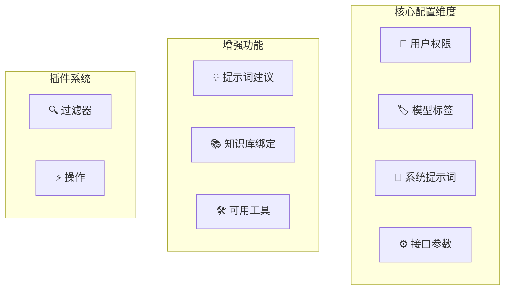
---

### 第二部分总结：智能工作台的价值

- **文件夹**：实现项目化管理，从混乱到秩序。
- **知识库**：构建专业智库，从碎片到系统。
- **用户提示词**：固化专家经验，从重复到高效。
- **模型配置**：打造专属AI，从单一到多元。

**最终构建真正的 AI 智囊团。**

---

# 第三部分：扩展功能
## ——Functions、Tools、OpenAPI Server 和 MCP Server

---

### Part 3.1: 四种扩展方式概览

```mermaid
graph TB
    subgraph comparison ["功能对比"]
        A["📊 对比维度"]
    end
    subgraph functions ["Functions<br/>(内部/Python)"]
        D["场景<br/>轻量级集成<br/>UI 定制"]
    end
    subgraph tools ["Tools<br/>(内部/Python)"]
        H["场景<br/>AI 能力扩展<br/>实时查询"]
    end
    subgraph openapi ["OpenAPI Server<br/>(外部/任意语言)"]
        L["场景<br/>复杂服务<br/>企业集成"]
    end
    subgraph mcp ["MCP Server<br/>(外部/任意语言)"]
        P["场景<br/>下一代集成<br/>多工具编排"]
    end
end
```
---

### Part 3.2: 选择决策树

```mermaid
graph TB
    start["我需要扩展 OpenWebUI"] --> q1{"需求类型？"}
    q1 -->|UI 定制/流程控制| a1["Functions"]
    q1 -->|AI 能力扩展| a2["Tools"]
    q1 -->|服务集成| q2{"现有系统？"}
    q2 -->|有现成 API| a3["OpenAPI Server"]
    q2 -->|需要新开发| q3{"未来规划？"}
    q3 -->|传统架构| a3
    q3 -->|现代化/AI 原生| a4["MCP Server"]
end
```

---

## 全文总结

OpenWebUI = **强大的协同对话** + **智能的工作台** + **无限的扩展性**

- **第一部分 (对话)**: 提供了业界领先的多模型协同能力。
- **第二部分 (工作台)**: 将AI对话系统化、项目化、知识化。
- **第三部分 (扩展)**: 提供了从轻量级插件到企业级集成的完整方案。

**OpenWebUI 不仅仅是一个对话界面，而是一个完整的 AI 应用开发与运营平台。**
